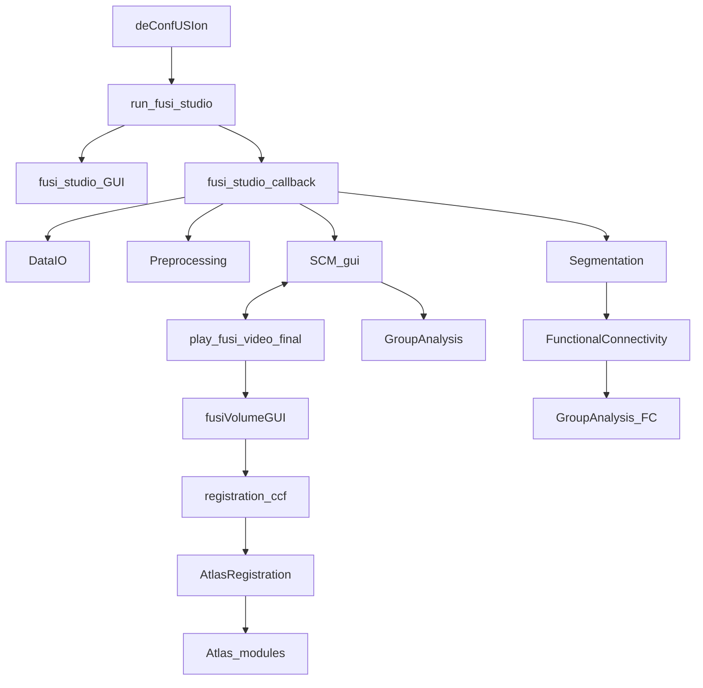

# Toolbox source map

237 active MATLAB files; 114,667 lines including comments.

Generated by `python maintenance/build_code_map.py`. Backups, validation outputs and tests are excluded from this runtime inventory.

Calls below are static symbol references, not proof that a branch executes. Dynamic `feval`, assembled Studio callbacks, MATLAB toolbox functions and external ITK-SNAP/Greedy tools require additional review.

The root holds supported launchers and public APIs. `lib` holds implementation modules. Run `deConfUSIon_setup` when using helpers directly; GUI entry points do this automatically. Never add backup directories to the MATLAB path.

## Main workflows

## File-by-file dependencies

The CSV versions are [inventory](code_inventory.csv) and [dependency edges](code_dependencies.csv).

### Public entry points and legacy APIs

| Script | Lines | Calls in toolbox | Referenced by |
|---|---:|---|---|
| [addLog.m](../addLog.m) | 85 | — | [coreg_3d](../coreg_3d.m), [fusi_studio_GUI](../fusi_studio_GUI.m) |
| [AtlasRegistration.m](../AtlasRegistration.m) | 917 | [deConfUSIon_setup](../deConfUSIon_setup.m), [deConfUSIon_ui](../deConfUSIon_ui.m), [interpolate3D](../interpolate3D.m), [fusiAtlasBrainMask](../lib/atlas/fusiAtlasBrainMask.m), [fusiOpenSnapWorkspace](../lib/atlas/fusiOpenSnapWorkspace.m), [fusiRegistrationFeatures](../lib/atlas/fusiRegistrationFeatures.m), [fusiRegistrationSliceSupport](../lib/atlas/fusiRegistrationSliceSupport.m), [fusiSnapOverlayWorkspace](../lib/atlas/fusiSnapOverlayWorkspace.m), [fusiSnapVesselContrast](../lib/atlas/fusiSnapVesselContrast.m), [fusiAnalysisOutputPath](../lib/io/fusiAnalysisOutputPath.m) | [coreg_3d](../coreg_3d.m), [fusiWarpAtlasForDisplay](../lib/atlas/fusiWarpAtlasForDisplay.m), [fusiVolumeEditAtlasRegistration](../lib/volume/fusiVolumeEditAtlasRegistration.m), [registration_ccf](../registration_ccf.m), [registration_coronal_2d](../registration_coronal_2d.m) |
| [AutomaticSCM.m](../AutomaticSCM.m) | 207 | [deConfUSIon_setup](../deConfUSIon_setup.m), [deConfUSIon_signal](../deConfUSIon_signal.m), [scmROI](../lib/roi/scmROI.m), [scmSearchWindows](../lib/roi/scmSearchWindows.m) | [scmSearchCandidates](../lib/roi/scmSearchCandidates.m), [SCM_gui](../SCM_gui.m) |
| [blackbdy_iso.m](../blackbdy_iso.m) | 286 | — | [GroupAnalysis](../GroupAnalysis.m), [GroupAnalysis_Map](../GroupAnalysis_Map.m), [fusiVolumeColormap](../lib/volume/fusiVolumeColormap.m), [play_fusi_video_final](../play_fusi_video_final.m), [SCM_gui](../SCM_gui.m), [SCM_static_gui](../SCM_static_gui.m) |
| [chooseMotionModern.m](../chooseMotionModern.m) | 104 | [deConfUSIon_ui](../deConfUSIon_ui.m) | [Motion](../Motion.m) |
| [ClutterFilter.m](../ClutterFilter.m) | 12 | [deConfUSIon_setup](../deConfUSIon_setup.m), [deConfUSIon_svd_clutter](../lib/preprocessing/deConfUSIon_svd_clutter.m), [deConfUSIon_svd_clutter_gui](../lib/preprocessing/deConfUSIon_svd_clutter_gui.m) | — |
| [computePSC.m](../computePSC.m) | 296 | [deConfUSIon_setup](../deConfUSIon_setup.m), [deConfUSIon_signal](../deConfUSIon_signal.m) | [fusi_studio_callback](../fusi_studio_callback.m), [fusi_studio_GUI](../fusi_studio_GUI.m) |
| [coreg.m](../coreg.m) | 874 | [coreg_3d](../coreg_3d.m), [coreg_coronal_2d](../coreg_coronal_2d.m), [deConfUSIon_setup](../deConfUSIon_setup.m) | [fusi_studio_GUI](../fusi_studio_GUI.m) |
| [coreg_3d.m](../coreg_3d.m) | 964 | [addLog](../addLog.m), [AtlasRegistration](../AtlasRegistration.m), [deConfUSIon_setup](../deConfUSIon_setup.m), [deConfUSIon_prepare_atlas](../lib/atlas/deConfUSIon_prepare_atlas.m), [fusiAnalysisOutputPath](../lib/io/fusiAnalysisOutputPath.m), [fusiModelAnalysisFolder](../lib/io/fusiModelAnalysisFolder.m), [deConfUSIon_collapse_time](../lib/preprocessing/deConfUSIon_collapse_time.m), [scmSpatialCalibration](../lib/roi/scmSpatialCalibration.m), [registration_ccf](../registration_ccf.m) | [coreg](../coreg.m) |
| [coreg_coronal_2d.m](../coreg_coronal_2d.m) | 1,463 | [deConfUSIon_setup](../deConfUSIon_setup.m), [deConfUSIon_prepare_atlas](../lib/atlas/deConfUSIon_prepare_atlas.m), [deConfUSIon_collapse_time](../lib/preprocessing/deConfUSIon_collapse_time.m), [registration_coronal_2d](../registration_coronal_2d.m) | [coreg](../coreg.m) |
| [DataIO.m](../DataIO.m) | 381 | [deConfUSIon_setup](../deConfUSIon_setup.m), [deConfUSIon_ui](../deConfUSIon_ui.m), [deConfUSIon_finish_saves](../lib/io/deConfUSIon_finish_saves.m), [deConfUSIon_display_short_name](../lib/metadata/deConfUSIon_display_short_name.m) | [deConfUSIon_ui](../deConfUSIon_ui.m), [fusi_studio_callback](../fusi_studio_callback.m), [fusi_studio_GUI](../fusi_studio_GUI.m), [deConfUSIon_finish_saves](../lib/io/deConfUSIon_finish_saves.m), [studioSaveDataset](../lib/io/studioSaveDataset.m), [run_fusi_studio](../run_fusi_studio.m), [standardizedAnalysis](../standardizedAnalysis.m) |
| [datasetDropdownCallback.m](../datasetDropdownCallback.m) | 33 | — | [fusi_studio_GUI](../fusi_studio_GUI.m) |
| [deConfUSIon.m](../deConfUSIon.m) | 22 | [deConfUSIon_setup](../deConfUSIon_setup.m) | — |
| [deConfUSIon_root.m](../deConfUSIon_root.m) | 4 | — | [deConfUSIon_setup](../deConfUSIon_setup.m), [deConfUSIon_apply_rgb2acr](../lib/atlas/deConfUSIon_apply_rgb2acr.m), [deConfUSIon_prepare_atlas](../lib/atlas/deConfUSIon_prepare_atlas.m), [fusiAtlasRegroupUnderlay3D](../lib/atlas/fusiAtlasRegroupUnderlay3D.m), [fusiAtlasUnderlayLibrary2D](../lib/atlas/fusiAtlasUnderlayLibrary2D.m), [fusiFindAtlasUnderlay3D](../lib/atlas/fusiFindAtlasUnderlay3D.m), [deConfUSIon_fc_jm_order](../lib/connectivity/deConfUSIon_fc_jm_order.m), [fusiMovieStage](../lib/io/fusiMovieStage.m), [fusiVolumeAtlasContext](../lib/volume/fusiVolumeAtlasContext.m), [fusiVolumeEditAtlasRegistration](../lib/volume/fusiVolumeEditAtlasRegistration.m) |
| [deConfUSIon_setup.m](../deConfUSIon_setup.m) | 24 | [deConfUSIon_root](../deConfUSIon_root.m) | [deConfUSIon_reorder_FC_by_list](../atlas_tools/deConfUSIon_reorder_FC_by_list.m), [save_correct_colors](../atlas_tools/save_correct_colors.m), [AtlasRegistration](../AtlasRegistration.m), [AutomaticSCM](../AutomaticSCM.m), [ClutterFilter](../ClutterFilter.m), [computePSC](../computePSC.m), [coreg](../coreg.m), [coreg_3d](../coreg_3d.m), [coreg_coronal_2d](../coreg_coronal_2d.m), [DataIO](../DataIO.m), [deConfUSIon](../deConfUSIon.m), [deConfUSIon_signal](../deConfUSIon_signal.m), [deConfUSIon_ui](../deConfUSIon_ui.m), [deConfUSIon_utils](../deConfUSIon_utils.m), [despike](../despike.m), [Drift](../Drift.m), [DriftCompensation](../DriftCompensation.m), [filtering](../filtering.m), [frameRateQC](../frameRateQC.m), [FunctionalConnectivity](../FunctionalConnectivity.m), [fUSI_Live_Studio](../fUSI_Live_Studio.m), [fusiAtlasVolumeGUI](../fusiAtlasVolumeGUI.m), [fusiVolumeGUI](../fusiVolumeGUI.m), [GroupAnalysis](../GroupAnalysis.m), [GroupAnalysis_Common](../GroupAnalysis_Common.m), [GroupAnalysis_FC](../GroupAnalysis_FC.m), [GroupAnalysis_Map](../GroupAnalysis_Map.m), [ica_denoise](../ica_denoise.m), [imregdemons_preprocess](../imregdemons_preprocess.m), [interpolate3D](../interpolate3D.m), [interpolateRejectedVolumes](../interpolateRejectedVolumes.m), [loadFUSIData](../loadFUSIData.m), [mapscan](../mapscan.m), [mask](../mask.m), [Motion](../Motion.m), [motor](../motor.m), [openNiftiSCM](../openNiftiSCM.m), [pca_denoise](../pca_denoise.m), [play_fusi_video_final](../play_fusi_video_final.m), [qc_fusi](../qc_fusi.m), [registration_ccf](../registration_ccf.m), [registration_coronal_2d](../registration_coronal_2d.m), [run_deConfUSIon_tests](../run_deConfUSIon_tests.m), [run_fusi_studio](../run_fusi_studio.m), [SCM_gui](../SCM_gui.m), [SCM_static_gui](../SCM_static_gui.m), [scrubbing](../scrubbing.m), [Segmentation](../Segmentation.m), [showScmVideoSetupDialog](../showScmVideoSetupDialog.m), [standardizedAnalysis](../standardizedAnalysis.m), [studio_load_options_dark_dialog](../studio_load_options_dark_dialog.m), [studio_resolve_paths](../studio_resolve_paths.m), [temporalsmoothing](../temporalsmoothing.m), [tryReadSCMroiExportTxt](../tryReadSCMroiExportTxt.m), [viewFMRINifti](../viewFMRINifti.m) |
| [deConfUSIon_signal.m](../deConfUSIon_signal.m) | 289 | [deConfUSIon_setup](../deConfUSIon_setup.m), [deConfUSIon_ui](../deConfUSIon_ui.m) | [AutomaticSCM](../AutomaticSCM.m), [computePSC](../computePSC.m), [fusi_studio_callback](../fusi_studio_callback.m), [fusi_studio_GUI](../fusi_studio_GUI.m), [GroupAnalysis](../GroupAnalysis.m), [ica_denoise](../ica_denoise.m), [interpolateRejectedVolumes](../interpolateRejectedVolumes.m), [pca_denoise](../pca_denoise.m), [SCM_gui](../SCM_gui.m) |
| [deConfUSIon_ui.m](../deConfUSIon_ui.m) | 445 | [DataIO](../DataIO.m), [deConfUSIon_setup](../deConfUSIon_setup.m) | [AtlasRegistration](../AtlasRegistration.m), [chooseMotionModern](../chooseMotionModern.m), [DataIO](../DataIO.m), [deConfUSIon_signal](../deConfUSIon_signal.m), [despike](../despike.m), [filtering](../filtering.m), [frameRateQC](../frameRateQC.m), [FunctionalConnectivity](../FunctionalConnectivity.m), [fUSI_Live_Studio](../fUSI_Live_Studio.m), [fusi_studio_callback](../fusi_studio_callback.m), [fusi_studio_GUI](../fusi_studio_GUI.m), [GroupAnalysis](../GroupAnalysis.m), [ica_denoise](../ica_denoise.m), [imregdemons_preprocess](../imregdemons_preprocess.m), [interpolateRejectedVolumes](../interpolateRejectedVolumes.m), [deConfUSIon_FC_force_layout](../lib/connectivity/deConfUSIon_FC_force_layout.m), [deConfUSIon_popup_autofit_apply](../lib/display/deConfUSIon_popup_autofit_apply.m), [deConfUSIon_popup_autofit_timer](../lib/display/deConfUSIon_popup_autofit_timer.m), [deConfUSIon_popup_polish_now](../lib/display/deConfUSIon_popup_polish_now.m), [mask](../mask.m), [Motion](../Motion.m), [pca_denoise](../pca_denoise.m), [play_fusi_video_final](../play_fusi_video_final.m), [registration_ccf](../registration_ccf.m), [registration_coronal_2d](../registration_coronal_2d.m), [SCM_gui](../SCM_gui.m), [scrubbing](../scrubbing.m), [showScmVideoSetupDialog](../showScmVideoSetupDialog.m), [standardizedAnalysis](../standardizedAnalysis.m), [studio_load_options_dark_dialog](../studio_load_options_dark_dialog.m) |
| [deConfUSIon_utils.m](../deConfUSIon_utils.m) | 280 | [deConfUSIon_setup](../deConfUSIon_setup.m), [deConfUSIon_FC_force_layout](../lib/connectivity/deConfUSIon_FC_force_layout.m), [deConfUSIon_FC_remember_layout](../lib/connectivity/deConfUSIon_FC_remember_layout.m), [deConfUSIon_FC_stepmotor_read_folder](../lib/connectivity/deConfUSIon_FC_stepmotor_read_folder.m), [deConfUSIon_fix_scm_video_dialog_fonts](../lib/display/deConfUSIon_fix_scm_video_dialog_fonts.m), [deConfUSIon_popup_polish_now](../lib/display/deConfUSIon_popup_polish_now.m), [deConfUSIon_safe_preproc_save_path](../lib/io/deConfUSIon_safe_preproc_save_path.m), [deConfUSIon_compact_chain_name](../lib/metadata/deConfUSIon_compact_chain_name.m), [deConfUSIon_display_name_from_sources](../lib/metadata/deConfUSIon_display_name_from_sources.m), [deConfUSIon_write_full_display_metadata](../lib/metadata/deConfUSIon_write_full_display_metadata.m), [scmSpatialCalibration](../lib/roi/scmSpatialCalibration.m) | [fUSI_Live_Studio](../fUSI_Live_Studio.m), [fusi_studio_callback](../fusi_studio_callback.m), [fusi_studio_GUI](../fusi_studio_GUI.m), [GroupAnalysis](../GroupAnalysis.m), [ica_denoise](../ica_denoise.m), [deConfUSIon_best_visible_dataset_name](../lib/metadata/deConfUSIon_best_visible_dataset_name.m), [deConfUSIon_fix_processing_name](../lib/metadata/deConfUSIon_fix_processing_name.m), [deConfUSIon_svd_clutter_gui](../lib/preprocessing/deConfUSIon_svd_clutter_gui.m), [mask](../mask.m), [pca_denoise](../pca_denoise.m), [play_fusi_video_final](../play_fusi_video_final.m), [SCM_gui](../SCM_gui.m) |
| [despike.m](../despike.m) | 137 | [deConfUSIon_setup](../deConfUSIon_setup.m), [deConfUSIon_ui](../deConfUSIon_ui.m) | [fusi_studio_GUI](../fusi_studio_GUI.m) |
| [Drift.m](../Drift.m) | 22 | [deConfUSIon_setup](../deConfUSIon_setup.m), [DriftCompensation](../DriftCompensation.m), [deConfUSIon_build_artifact_regressors](../lib/preprocessing/deConfUSIon_build_artifact_regressors.m), [deConfUSIon_build_compcor_regressors](../lib/preprocessing/deConfUSIon_build_compcor_regressors.m), [deConfUSIon_pacap_common_drift_stats](../lib/preprocessing/deConfUSIon_pacap_common_drift_stats.m), [deConfUSIon_pacap_response_estimator](../lib/preprocessing/deConfUSIon_pacap_response_estimator.m), [deConfUSIon_spatial_cca_simple](../lib/preprocessing/deConfUSIon_spatial_cca_simple.m) | — |
| [DriftCompensation.m](../DriftCompensation.m) | 44 | [deConfUSIon_setup](../deConfUSIon_setup.m), [deConfUSIon_drift_dialog](../lib/preprocessing/deConfUSIon_drift_dialog.m), [deConfUSIon_driftcompensation_core](../lib/preprocessing/deConfUSIon_driftcompensation_core.m), [deConfUSIon_pacap_common_drift_stats](../lib/preprocessing/deConfUSIon_pacap_common_drift_stats.m), [deConfUSIon_pacap_response_estimator](../lib/preprocessing/deConfUSIon_pacap_response_estimator.m) | [Drift](../Drift.m), [fusi_studio_GUI](../fusi_studio_GUI.m) |
| [filtering.m](../filtering.m) | 559 | [deConfUSIon_setup](../deConfUSIon_setup.m), [deConfUSIon_ui](../deConfUSIon_ui.m) | [fusi_studio_GUI](../fusi_studio_GUI.m) |
| [frameRateQC.m](../frameRateQC.m) | 171 | [deConfUSIon_setup](../deConfUSIon_setup.m), [deConfUSIon_ui](../deConfUSIon_ui.m) | [fusi_studio_GUI](../fusi_studio_GUI.m) |
| [FunctionalConnectivity.m](../FunctionalConnectivity.m) | 10,559 | [deConfUSIon_setup](../deConfUSIon_setup.m), [deConfUSIon_ui](../deConfUSIon_ui.m), [fusiAtlasRegionInput](../lib/atlas/fusiAtlasRegionInput.m), [fusiCachedAtlasUnderlay3D](../lib/atlas/fusiCachedAtlasUnderlay3D.m), [deConfUSIon_FC_force_layout](../lib/connectivity/deConfUSIon_FC_force_layout.m), [deConfUSIon_fc_jm_order](../lib/connectivity/deConfUSIon_fc_jm_order.m), [deConfUSIon_FC_layout](../lib/connectivity/deConfUSIon_FC_layout.m), [deConfUSIon_FC_make_slice_roi_result](../lib/connectivity/deConfUSIon_FC_make_slice_roi_result.m), [deConfUSIon_FC_read_region_names_file](../lib/connectivity/deConfUSIon_FC_read_region_names_file.m), [deConfUSIon_FC_remember_layout](../lib/connectivity/deConfUSIon_FC_remember_layout.m), [deConfUSIon_FC_stepmotor_read_folder](../lib/connectivity/deConfUSIon_FC_stepmotor_read_folder.m), [fusiFCCorrelationMatrix](../lib/connectivity/fusiFCCorrelationMatrix.m), [fusiAnalysisOutputPath](../lib/io/fusiAnalysisOutputPath.m), [mask](../mask.m) | [fusi_studio_GUI](../fusi_studio_GUI.m) |
| [fusi_fix_saved_format.m](../fusi_fix_saved_format.m) | 309 | — | — |
| [fUSI_Live_Studio.m](../fUSI_Live_Studio.m) | 2,217 | [deConfUSIon_setup](../deConfUSIon_setup.m), [deConfUSIon_ui](../deConfUSIon_ui.m), [deConfUSIon_utils](../deConfUSIon_utils.m), [imregdemons_preprocess](../imregdemons_preprocess.m) | [fusi_studio_callback](../fusi_studio_callback.m) |
| [fusi_make_clean.m](../fusi_make_clean.m) | 404 | — | — |
| [fusi_studio_callback.m](../fusi_studio_callback.m) | 5,505 | [computePSC](../computePSC.m), [DataIO](../DataIO.m), [deConfUSIon_signal](../deConfUSIon_signal.m), [deConfUSIon_ui](../deConfUSIon_ui.m), [deConfUSIon_utils](../deConfUSIon_utils.m), [fUSI_Live_Studio](../fUSI_Live_Studio.m), [deConfUSIon_FC_read_region_names_file](../lib/connectivity/deConfUSIon_FC_read_region_names_file.m), [deConfUSIon_popup_autofit_apply](../lib/display/deConfUSIon_popup_autofit_apply.m), [deConfUSIon_best_visible_dataset_name](../lib/metadata/deConfUSIon_best_visible_dataset_name.m), [deConfUSIon_display_name_from_sources](../lib/metadata/deConfUSIon_display_name_from_sources.m), [deConfUSIon_display_short_name](../lib/metadata/deConfUSIon_display_short_name.m), [deConfUSIon_fix_processing_name](../lib/metadata/deConfUSIon_fix_processing_name.m), [deConfUSIon_fix_studio_dataset_names](../lib/metadata/deConfUSIon_fix_studio_dataset_names.m), [loadFUSIData](../loadFUSIData.m), [mask](../mask.m), [play_fusi_video_final](../play_fusi_video_final.m), [SCM_gui](../SCM_gui.m) | [run_fusi_studio](../run_fusi_studio.m) |
| [fusi_studio_GUI.m](../fusi_studio_GUI.m) | 7,328 | [addLog](../addLog.m), [computePSC](../computePSC.m), [coreg](../coreg.m), [DataIO](../DataIO.m), [datasetDropdownCallback](../datasetDropdownCallback.m), [deConfUSIon_signal](../deConfUSIon_signal.m), [deConfUSIon_ui](../deConfUSIon_ui.m), [deConfUSIon_utils](../deConfUSIon_utils.m), [despike](../despike.m), [DriftCompensation](../DriftCompensation.m), [filtering](../filtering.m), [frameRateQC](../frameRateQC.m), [FunctionalConnectivity](../FunctionalConnectivity.m), [GroupAnalysis](../GroupAnalysis.m), [ica_denoise](../ica_denoise.m), [imregdemons_preprocess](../imregdemons_preprocess.m), [interpolateRejectedVolumes](../interpolateRejectedVolumes.m), [deConfUSIon_FC_find_stepmotor_txt_names](../lib/connectivity/deConfUSIon_FC_find_stepmotor_txt_names.m), [deConfUSIon_FC_read_region_names_file](../lib/connectivity/deConfUSIon_FC_read_region_names_file.m), [deConfUSIon_find_stepmotor_seg_fc_files](../lib/connectivity/deConfUSIon_find_stepmotor_seg_fc_files.m), [deConfUSIon_fix_scm_video_dialog_fonts](../lib/display/deConfUSIon_fix_scm_video_dialog_fonts.m), [deConfUSIon_popup_autofit_apply](../lib/display/deConfUSIon_popup_autofit_apply.m), [deConfUSIon_popup_polish_now](../lib/display/deConfUSIon_popup_polish_now.m), [deConfUSIon_safe_preproc_save_path](../lib/io/deConfUSIon_safe_preproc_save_path.m), [studioRequireTimeSeriesFile](../lib/io/studioRequireTimeSeriesFile.m), [studioSaveDataset](../lib/io/studioSaveDataset.m), [deConfUSIon_add_preproc_lazy_datasets](../lib/metadata/deConfUSIon_add_preproc_lazy_datasets.m), [deConfUSIon_compact_chain_name](../lib/metadata/deConfUSIon_compact_chain_name.m), [deConfUSIon_display_short_name](../lib/metadata/deConfUSIon_display_short_name.m), [deConfUSIon_drift_dialog](../lib/preprocessing/deConfUSIon_drift_dialog.m), [deConfUSIon_svd_clutter_gui](../lib/preprocessing/deConfUSIon_svd_clutter_gui.m), [loadFUSIData](../loadFUSIData.m), [Motion](../Motion.m), [motor](../motor.m), [pca_denoise](../pca_denoise.m), [qc_fusi](../qc_fusi.m), [scrubbing](../scrubbing.m), [Segmentation](../Segmentation.m), [standardizedAnalysis](../standardizedAnalysis.m), [studio_load_options_dark_dialog](../studio_load_options_dark_dialog.m), [studio_resolve_paths](../studio_resolve_paths.m), [temporalsmoothing](../temporalsmoothing.m) | [run_fusi_studio](../run_fusi_studio.m) |
| [fusiAtlasVolumeGUI.m](../fusiAtlasVolumeGUI.m) | 35 | [deConfUSIon_setup](../deConfUSIon_setup.m), [fusiVolumeGUI](../fusiVolumeGUI.m), [fusiAtlasBrainMask](../lib/atlas/fusiAtlasBrainMask.m) | [fusiVolumeGUI](../fusiVolumeGUI.m), [play_fusi_video_final](../play_fusi_video_final.m) |
| [fusiVolumeGUI.m](../fusiVolumeGUI.m) | 1,308 | [deConfUSIon_setup](../deConfUSIon_setup.m), [fusiAtlasVolumeGUI](../fusiAtlasVolumeGUI.m), [fusiAtlasReferenceSlabs](../lib/atlas/fusiAtlasReferenceSlabs.m), [fusiAtlasTransformFolder](../lib/atlas/fusiAtlasTransformFolder.m), [fusiOverlayAppearance](../lib/display/fusiOverlayAppearance.m), [fusiExportSavedDialog](../lib/io/fusiExportSavedDialog.m), [fusiModelAnalysisFolder](../lib/io/fusiModelAnalysisFolder.m), [fusiModelExportPath](../lib/io/fusiModelExportPath.m), [scmSpatialCalibration](../lib/roi/scmSpatialCalibration.m), [fusiExportVolume](../lib/volume/fusiExportVolume.m), [fusiVolumeAtlasContext](../lib/volume/fusiVolumeAtlasContext.m), [fusiVolumeAutoAppearance](../lib/volume/fusiVolumeAutoAppearance.m), [fusiVolumeBaseline](../lib/volume/fusiVolumeBaseline.m), [fusiVolumeColormap](../lib/volume/fusiVolumeColormap.m), [fusiVolumeControlsLayout](../lib/volume/fusiVolumeControlsLayout.m), [fusiVolumeDecorations](../lib/volume/fusiVolumeDecorations.m), [fusiVolumeDisplayOrientation](../lib/volume/fusiVolumeDisplayOrientation.m), [fusiVolumeEditAtlasRegistration](../lib/volume/fusiVolumeEditAtlasRegistration.m), [fusiVolumeGeometry](../lib/volume/fusiVolumeGeometry.m), [fusiVolumePSCColormap](../lib/volume/fusiVolumePSCColormap.m), [fusiVolumeRefitStackCamera](../lib/volume/fusiVolumeRefitStackCamera.m), [fusiVolumeRememberCamera](../lib/volume/fusiVolumeRememberCamera.m), [fusiVolumeReviewAtlas](../lib/volume/fusiVolumeReviewAtlas.m), [fusiVolumeRGBA](../lib/volume/fusiVolumeRGBA.m), [fusiVolumeSlabGeometry](../lib/volume/fusiVolumeSlabGeometry.m), [fusiVolumeSlabMean](../lib/volume/fusiVolumeSlabMean.m), [fusiVolumeSnapshot](../lib/volume/fusiVolumeSnapshot.m), [fusiVolumeStackCamera](../lib/volume/fusiVolumeStackCamera.m), [fusiVolumeStackLayout](../lib/volume/fusiVolumeStackLayout.m), [fusiVolumeSurfaceMesh](../lib/volume/fusiVolumeSurfaceMesh.m), [fusiVolumeVoxelFaces](../lib/volume/fusiVolumeVoxelFaces.m) | [fusiAtlasVolumeGUI](../fusiAtlasVolumeGUI.m), [play_fusi_video_final](../play_fusi_video_final.m) |
| [GroupAnalysis.m](../GroupAnalysis.m) | 11,630 | [blackbdy_iso](../blackbdy_iso.m), [deConfUSIon_setup](../deConfUSIon_setup.m), [deConfUSIon_signal](../deConfUSIon_signal.m), [deConfUSIon_ui](../deConfUSIon_ui.m), [deConfUSIon_utils](../deConfUSIon_utils.m), [GroupAnalysis_Common](../GroupAnalysis_Common.m), [GroupAnalysis_FC](../GroupAnalysis_FC.m), [GroupAnalysis_Map](../GroupAnalysis_Map.m), [gaDrawROISignificance](../lib/group/gaDrawROISignificance.m), [gaInferAssignment](../lib/group/gaInferAssignment.m), [mask](../mask.m), [winter_brain_fsl](../winter_brain_fsl.m) | [fusi_studio_GUI](../fusi_studio_GUI.m) |
| [GroupAnalysis_Common.m](../GroupAnalysis_Common.m) | 3,542 | [deConfUSIon_setup](../deConfUSIon_setup.m), [gaDrawROISignificance](../lib/group/gaDrawROISignificance.m), [gaFormatPValue](../lib/group/gaFormatPValue.m), [gaMaximumPlateau](../lib/group/gaMaximumPlateau.m), [gaOutlierScores](../lib/group/gaOutlierScores.m) | [GroupAnalysis](../GroupAnalysis.m) |
| [GroupAnalysis_FC.m](../GroupAnalysis_FC.m) | 363 | [deConfUSIon_setup](../deConfUSIon_setup.m) | [GroupAnalysis](../GroupAnalysis.m) |
| [GroupAnalysis_Map.m](../GroupAnalysis_Map.m) | 891 | [blackbdy_iso](../blackbdy_iso.m), [deConfUSIon_setup](../deConfUSIon_setup.m), [winter_brain_fsl](../winter_brain_fsl.m) | [GroupAnalysis](../GroupAnalysis.m) |
| [ica_denoise.m](../ica_denoise.m) | 574 | [deConfUSIon_setup](../deConfUSIon_setup.m), [deConfUSIon_signal](../deConfUSIon_signal.m), [deConfUSIon_ui](../deConfUSIon_ui.m), [deConfUSIon_utils](../deConfUSIon_utils.m) | [fusi_studio_GUI](../fusi_studio_GUI.m) |
| [imregdemons_preprocess.m](../imregdemons_preprocess.m) | 536 | [deConfUSIon_setup](../deConfUSIon_setup.m), [deConfUSIon_ui](../deConfUSIon_ui.m) | [fUSI_Live_Studio](../fUSI_Live_Studio.m), [fusi_studio_GUI](../fusi_studio_GUI.m) |
| [interpolate3D.m](../interpolate3D.m) | 91 | [deConfUSIon_setup](../deConfUSIon_setup.m) | [AtlasRegistration](../AtlasRegistration.m), [deConfUSIon_auto_register_3d](../lib/atlas/deConfUSIon_auto_register_3d.m) |
| [interpolateRejectedVolumes.m](../interpolateRejectedVolumes.m) | 25 | [deConfUSIon_setup](../deConfUSIon_setup.m), [deConfUSIon_signal](../deConfUSIon_signal.m), [deConfUSIon_ui](../deConfUSIon_ui.m) | [fusi_studio_GUI](../fusi_studio_GUI.m) |
| [loadDataCallback.m](../loadDataCallback.m) | 304 | [studioRequireTimeSeriesFile](../lib/io/studioRequireTimeSeriesFile.m), [loadFUSIData](../loadFUSIData.m), [studio_load_options_dark_dialog](../studio_load_options_dark_dialog.m) | — |
| [loadFUSIData.m](../loadFUSIData.m) | 970 | [deConfUSIon_setup](../deConfUSIon_setup.m), [readFMRINifti](../readFMRINifti.m) | [fusi_studio_callback](../fusi_studio_callback.m), [fusi_studio_GUI](../fusi_studio_GUI.m), [loadDataCallback](../loadDataCallback.m) |
| [mapscan.m](../mapscan.m) | 110 | [deConfUSIon_setup](../deConfUSIon_setup.m) | [registration_ccf](../registration_ccf.m) |
| [mask.m](../mask.m) | 3,920 | [deConfUSIon_setup](../deConfUSIon_setup.m), [deConfUSIon_ui](../deConfUSIon_ui.m), [deConfUSIon_utils](../deConfUSIon_utils.m), [fusiAutoMaskVolume3D](../lib/display/fusiAutoMaskVolume3D.m), [scmSpatialCalibration](../lib/roi/scmSpatialCalibration.m) | [FunctionalConnectivity](../FunctionalConnectivity.m), [fusi_studio_callback](../fusi_studio_callback.m), [GroupAnalysis](../GroupAnalysis.m), [fusiAutoMaskVolume3D](../lib/display/fusiAutoMaskVolume3D.m), [deConfUSIon_driftcompensation_core](../lib/preprocessing/deConfUSIon_driftcompensation_core.m), [scmAutoSearchDialog](../lib/roi/scmAutoSearchDialog.m), [scmPaintMask](../lib/roi/scmPaintMask.m), [scmROI](../lib/roi/scmROI.m), [fusiVolumeSnapshot](../lib/volume/fusiVolumeSnapshot.m), [play_fusi_video_final](../play_fusi_video_final.m), [SCM_gui](../SCM_gui.m), [scrubbing](../scrubbing.m) |
| [Motion.m](../Motion.m) | 63 | [chooseMotionModern](../chooseMotionModern.m), [deConfUSIon_setup](../deConfUSIon_setup.m), [deConfUSIon_ui](../deConfUSIon_ui.m) | [fusi_studio_GUI](../fusi_studio_GUI.m) |
| [motor.m](../motor.m) | 1,707 | [deConfUSIon_setup](../deConfUSIon_setup.m) | [fusi_studio_GUI](../fusi_studio_GUI.m), [deConfUSIon_display_name_from_sources](../lib/metadata/deConfUSIon_display_name_from_sources.m) |
| [moveimage.m](../moveimage.m) | 299 | — | [registration_ccf](../registration_ccf.m) |
| [openNiftiSCM.m](../openNiftiSCM.m) | 36 | [deConfUSIon_setup](../deConfUSIon_setup.m), [readFMRINifti](../readFMRINifti.m), [SCM_gui](../SCM_gui.m) | [viewFMRINifti](../viewFMRINifti.m) |
| [pca_denoise.m](../pca_denoise.m) | 326 | [deConfUSIon_setup](../deConfUSIon_setup.m), [deConfUSIon_signal](../deConfUSIon_signal.m), [deConfUSIon_ui](../deConfUSIon_ui.m), [deConfUSIon_utils](../deConfUSIon_utils.m) | [fusi_studio_GUI](../fusi_studio_GUI.m) |
| [play_fusi_video_final.m](../play_fusi_video_final.m) | 6,959 | [blackbdy_iso](../blackbdy_iso.m), [deConfUSIon_setup](../deConfUSIon_setup.m), [deConfUSIon_ui](../deConfUSIon_ui.m), [deConfUSIon_utils](../deConfUSIon_utils.m), [fusiAtlasVolumeGUI](../fusiAtlasVolumeGUI.m), [fusiVolumeGUI](../fusiVolumeGUI.m), [fusiAtlasPairedTransformFile](../lib/atlas/fusiAtlasPairedTransformFile.m), [fusiAtlasRegroupUnderlay3D](../lib/atlas/fusiAtlasRegroupUnderlay3D.m), [fusiAtlasSearchContext](../lib/atlas/fusiAtlasSearchContext.m), [fusiAtlasUnderlayChoices](../lib/atlas/fusiAtlasUnderlayChoices.m), [fusiAtlasUnderlayLibrary2D](../lib/atlas/fusiAtlasUnderlayLibrary2D.m), [fusiCachedAtlasUnderlay3D](../lib/atlas/fusiCachedAtlasUnderlay3D.m), [fusiCachedAtlasUnderlayView3D](../lib/atlas/fusiCachedAtlasUnderlayView3D.m), [fusiChooseAtlasTransformFile](../lib/atlas/fusiChooseAtlasTransformFile.m), [fusiChooseUnderlayFile](../lib/atlas/fusiChooseUnderlayFile.m), [fusiFindAtlasUnderlay3D](../lib/atlas/fusiFindAtlasUnderlay3D.m), [fusiReadAtlasUnderlay3D](../lib/atlas/fusiReadAtlasUnderlay3D.m), [fusiUnderlayPickerOptions](../lib/atlas/fusiUnderlayPickerOptions.m), [fusiWarpAtlasForDisplay](../lib/atlas/fusiWarpAtlasForDisplay.m), [fusiCopyVideoMask](../lib/display/fusiCopyVideoMask.m), [fusiRegionAnnotations](../lib/display/fusiRegionAnnotations.m), [fusiRegionBoundaryOverlay](../lib/display/fusiRegionBoundaryOverlay.m), [fusiRegionColorLUT](../lib/display/fusiRegionColorLUT.m), [fusiRegionLabelRGB](../lib/display/fusiRegionLabelRGB.m), [fusiRegionListDialog](../lib/display/fusiRegionListDialog.m), [fusiResizeDisplayLayer](../lib/display/fusiResizeDisplayLayer.m), [fusiAnalysisOutputPath](../lib/io/fusiAnalysisOutputPath.m), [fusiExportSavedDialog](../lib/io/fusiExportSavedDialog.m), [fusiModelAnalysisFolder](../lib/io/fusiModelAnalysisFolder.m), [fusiMovieStage](../lib/io/fusiMovieStage.m), [fusiPaperMoviePath](../lib/io/fusiPaperMoviePath.m), [scmReadMaskEditorBundle](../lib/roi/scmReadMaskEditorBundle.m), [mask](../mask.m), [SCM_gui](../SCM_gui.m), [winter_brain_fsl](../winter_brain_fsl.m) | [fusi_studio_callback](../fusi_studio_callback.m), [SCM_gui](../SCM_gui.m) |
| [qc_fusi.m](../qc_fusi.m) | 2,025 | [deConfUSIon_setup](../deConfUSIon_setup.m) | [fusi_studio_GUI](../fusi_studio_GUI.m) |
| [readFileList.m](../readFileList.m) | 133 | — | [deConfUSIon_reorder_FC_by_list](../atlas_tools/deConfUSIon_reorder_FC_by_list.m), [deConfUSIon_prepare_atlas](../lib/atlas/deConfUSIon_prepare_atlas.m) |
| [readFMRINifti.m](../readFMRINifti.m) | 13 | — | [loadFUSIData](../loadFUSIData.m), [openNiftiSCM](../openNiftiSCM.m), [SCM_static_gui](../SCM_static_gui.m), [viewFMRINifti](../viewFMRINifti.m) |
| [registration_ccf.m](../registration_ccf.m) | 2,634 | [AtlasRegistration](../AtlasRegistration.m), [deConfUSIon_setup](../deConfUSIon_setup.m), [deConfUSIon_ui](../deConfUSIon_ui.m), [deConfUSIon_apply_rgb2acr](../lib/atlas/deConfUSIon_apply_rgb2acr.m), [fusiAtlasRegionGrouping](../lib/atlas/fusiAtlasRegionGrouping.m), [fusiAtlasSizeMatrix](../lib/atlas/fusiAtlasSizeMatrix.m), [fusiBregmaAnchors](../lib/atlas/fusiBregmaAnchors.m), [fusiFitCoronalAnchors](../lib/atlas/fusiFitCoronalAnchors.m), [fusiImportSnapAdjustment](../lib/atlas/fusiImportSnapAdjustment.m), [fusiOpenSnapWorkspace](../lib/atlas/fusiOpenSnapWorkspace.m), [fusiRegistrationConfigureSlices](../lib/atlas/fusiRegistrationConfigureSlices.m), [fusiRegistrationDisplayVolume](../lib/atlas/fusiRegistrationDisplayVolume.m), [fusiRegistrationOverlayAlpha](../lib/atlas/fusiRegistrationOverlayAlpha.m), [fusiRegistrationOverlayAppearance](../lib/atlas/fusiRegistrationOverlayAppearance.m), [fusiRegistrationSliceSupport](../lib/atlas/fusiRegistrationSliceSupport.m), [fusiSaveAtlasUnderlays3D](../lib/atlas/fusiSaveAtlasUnderlays3D.m), [fusiDrawRegionBoundaries](../lib/display/fusiDrawRegionBoundaries.m), [fusiAnalysisOutputPath](../lib/io/fusiAnalysisOutputPath.m), [fusiUniqueOutputFolder](../lib/io/fusiUniqueOutputFolder.m), [mapscan](../mapscan.m), [moveimage](../moveimage.m), [registration_coronal_2d](../registration_coronal_2d.m) | [coreg_3d](../coreg_3d.m), [fusiVolumeEditAtlasRegistration](../lib/volume/fusiVolumeEditAtlasRegistration.m) |
| [registration_coronal_2d.m](../registration_coronal_2d.m) | 1,930 | [AtlasRegistration](../AtlasRegistration.m), [deConfUSIon_setup](../deConfUSIon_setup.m), [deConfUSIon_ui](../deConfUSIon_ui.m), [deConfUSIon_apply_rgb2acr](../lib/atlas/deConfUSIon_apply_rgb2acr.m), [fusiCoronalSliceGuide](../lib/atlas/fusiCoronalSliceGuide.m), [fusiFitCoronalAnchors](../lib/atlas/fusiFitCoronalAnchors.m), [fusiAnalysisOutputPath](../lib/io/fusiAnalysisOutputPath.m), [fusiUniqueOutputFolder](../lib/io/fusiUniqueOutputFolder.m) | [coreg_coronal_2d](../coreg_coronal_2d.m), [registration_ccf](../registration_ccf.m) |
| [run_deConfUSIon_tests.m](../run_deConfUSIon_tests.m) | 7 | [deConfUSIon_setup](../deConfUSIon_setup.m) | — |
| [run_fusi_studio.m](../run_fusi_studio.m) | 158 | [DataIO](../DataIO.m), [deConfUSIon_setup](../deConfUSIon_setup.m), [fusi_studio_callback](../fusi_studio_callback.m), [fusi_studio_GUI](../fusi_studio_GUI.m), [deConfUSIon_popup_autofit_timer](../lib/display/deConfUSIon_popup_autofit_timer.m) | — |
| [SCM_gui.m](../SCM_gui.m) | 8,392 | [AutomaticSCM](../AutomaticSCM.m), [blackbdy_iso](../blackbdy_iso.m), [deConfUSIon_setup](../deConfUSIon_setup.m), [deConfUSIon_signal](../deConfUSIon_signal.m), [deConfUSIon_ui](../deConfUSIon_ui.m), [deConfUSIon_utils](../deConfUSIon_utils.m), [fusiAtlasPairedTransformFile](../lib/atlas/fusiAtlasPairedTransformFile.m), [fusiAtlasRegionCatalog](../lib/atlas/fusiAtlasRegionCatalog.m), [fusiAtlasRegroupUnderlay3D](../lib/atlas/fusiAtlasRegroupUnderlay3D.m), [fusiAtlasSearchContext](../lib/atlas/fusiAtlasSearchContext.m), [fusiAtlasUnderlayChoices](../lib/atlas/fusiAtlasUnderlayChoices.m), [fusiAtlasUnderlayLibrary2D](../lib/atlas/fusiAtlasUnderlayLibrary2D.m), [fusiCachedAtlasUnderlay3D](../lib/atlas/fusiCachedAtlasUnderlay3D.m), [fusiCachedAtlasUnderlayView3D](../lib/atlas/fusiCachedAtlasUnderlayView3D.m), [fusiChooseAtlasTransformFile](../lib/atlas/fusiChooseAtlasTransformFile.m), [fusiChooseUnderlayFile](../lib/atlas/fusiChooseUnderlayFile.m), [fusiFindAtlasUnderlay3D](../lib/atlas/fusiFindAtlasUnderlay3D.m), [fusiReadAtlasUnderlay3D](../lib/atlas/fusiReadAtlasUnderlay3D.m), [fusiUnderlayPickerOptions](../lib/atlas/fusiUnderlayPickerOptions.m), [fusiWarpAtlasForDisplay](../lib/atlas/fusiWarpAtlasForDisplay.m), [fusiDrawScaleBar](../lib/display/fusiDrawScaleBar.m), [fusiRegionAnnotations](../lib/display/fusiRegionAnnotations.m), [fusiRegionBoundaryOverlay](../lib/display/fusiRegionBoundaryOverlay.m), [fusiRegionColorLUT](../lib/display/fusiRegionColorLUT.m), [fusiRegionLabelRGB](../lib/display/fusiRegionLabelRGB.m), [fusiRegionListDialog](../lib/display/fusiRegionListDialog.m), [fusiAnalysisOutputPath](../lib/io/fusiAnalysisOutputPath.m), [scmAutomaticDisplay](../lib/roi/scmAutomaticDisplay.m), [scmAutoSearchDialog](../lib/roi/scmAutoSearchDialog.m), [scmAwakeSearchWindow](../lib/roi/scmAwakeSearchWindow.m), [scmCandidateOrder](../lib/roi/scmCandidateOrder.m), [scmCandidateTableColors](../lib/roi/scmCandidateTableColors.m), [scmExportROIBundles](../lib/roi/scmExportROIBundles.m), [scmExportSearchParameters](../lib/roi/scmExportSearchParameters.m), [scmExportSliceRange](../lib/roi/scmExportSliceRange.m), [scmProbeSpacing](../lib/roi/scmProbeSpacing.m), [scmPublishPpt](../lib/roi/scmPublishPpt.m), [scmReadMaskEditorBundle](../lib/roi/scmReadMaskEditorBundle.m), [scmROI](../lib/roi/scmROI.m), [scmROIWindowTag](../lib/roi/scmROIWindowTag.m), [scmSearchCandidates](../lib/roi/scmSearchCandidates.m), [scmSearchParameterSummary](../lib/roi/scmSearchParameterSummary.m), [scmSearchSlices](../lib/roi/scmSearchSlices.m), [scmSharedDisplay](../lib/roi/scmSharedDisplay.m), [scmSpatialCalibration](../lib/roi/scmSpatialCalibration.m), [scmTopCandidates](../lib/roi/scmTopCandidates.m), [scmWriteAtlasSelectionHeader](../lib/roi/scmWriteAtlasSelectionHeader.m), [mask](../mask.m), [play_fusi_video_final](../play_fusi_video_final.m), [SCM_static_gui](../SCM_static_gui.m), [showScmVideoSetupDialog](../showScmVideoSetupDialog.m), [winter_brain_fsl](../winter_brain_fsl.m) | [fusi_studio_callback](../fusi_studio_callback.m), [openNiftiSCM](../openNiftiSCM.m), [play_fusi_video_final](../play_fusi_video_final.m) |
| [SCM_static_gui.m](../SCM_static_gui.m) | 155 | [blackbdy_iso](../blackbdy_iso.m), [deConfUSIon_setup](../deConfUSIon_setup.m), [scmStaticROI](../lib/roi/scmStaticROI.m), [readFMRINifti](../readFMRINifti.m), [viewFMRINifti](../viewFMRINifti.m) | [SCM_gui](../SCM_gui.m) |
| [scrubbing.m](../scrubbing.m) | 605 | [deConfUSIon_setup](../deConfUSIon_setup.m), [deConfUSIon_ui](../deConfUSIon_ui.m), [mask](../mask.m) | [fusi_studio_GUI](../fusi_studio_GUI.m) |
| [Segmentation.m](../Segmentation.m) | 2,286 | [deConfUSIon_setup](../deConfUSIon_setup.m), [deConfUSIon_prepare_atlas](../lib/atlas/deConfUSIon_prepare_atlas.m), [deConfUSIon_region_groups](../lib/atlas/deConfUSIon_region_groups.m), [fusiAtlasRegionCatalog](../lib/atlas/fusiAtlasRegionCatalog.m), [fusiAtlasRegionGrouping](../lib/atlas/fusiAtlasRegionGrouping.m), [fusiAtlasRegionInput](../lib/atlas/fusiAtlasRegionInput.m), [fusiUnderlayPickerOptions](../lib/atlas/fusiUnderlayPickerOptions.m), [deConfUSIon_find_stepmotor_seg_fc_files](../lib/connectivity/deConfUSIon_find_stepmotor_seg_fc_files.m) | [fusi_studio_GUI](../fusi_studio_GUI.m) |
| [showScmVideoSetupDialog.m](../showScmVideoSetupDialog.m) | 1,027 | [deConfUSIon_setup](../deConfUSIon_setup.m), [deConfUSIon_ui](../deConfUSIon_ui.m) | [SCM_gui](../SCM_gui.m) |
| [standardizedAnalysis.m](../standardizedAnalysis.m) | 1,129 | [DataIO](../DataIO.m), [deConfUSIon_setup](../deConfUSIon_setup.m), [deConfUSIon_ui](../deConfUSIon_ui.m) | [fusi_studio_GUI](../fusi_studio_GUI.m) |
| [studio_load_options_dark_dialog.m](../studio_load_options_dark_dialog.m) | 576 | [deConfUSIon_setup](../deConfUSIon_setup.m), [deConfUSIon_ui](../deConfUSIon_ui.m) | [fusi_studio_GUI](../fusi_studio_GUI.m), [loadDataCallback](../loadDataCallback.m) |
| [studio_resolve_paths.m](../studio_resolve_paths.m) | 176 | [deConfUSIon_setup](../deConfUSIon_setup.m) | [fusi_studio_GUI](../fusi_studio_GUI.m) |
| [temporalsmoothing.m](../temporalsmoothing.m) | 271 | [deConfUSIon_setup](../deConfUSIon_setup.m) | [fusi_studio_GUI](../fusi_studio_GUI.m) |
| [tryReadSCMroiExportTxt.m](../tryReadSCMroiExportTxt.m) | 49 | [deConfUSIon_setup](../deConfUSIon_setup.m) | — |
| [viewFMRINifti.m](../viewFMRINifti.m) | 86 | [deConfUSIon_setup](../deConfUSIon_setup.m), [openNiftiSCM](../openNiftiSCM.m), [readFMRINifti](../readFMRINifti.m) | [SCM_static_gui](../SCM_static_gui.m) |
| [winter_brain_fsl.m](../winter_brain_fsl.m) | 285 | — | [GroupAnalysis](../GroupAnalysis.m), [GroupAnalysis_Map](../GroupAnalysis_Map.m), [fusiVolumeColormap](../lib/volume/fusiVolumeColormap.m), [play_fusi_video_final](../play_fusi_video_final.m), [SCM_gui](../SCM_gui.m) |

### acquisition

| Script | Lines | Calls in toolbox | Referenced by |
|---|---:|---|---|
| [vfUSI_StimBox_TTL_EACH_FRAME_OR_TRIGGER_ACCESSORIES_COMMAND.m](../acquisition/vfUSI_StimBox_TTL_EACH_FRAME_OR_TRIGGER_ACCESSORIES_COMMAND.m) | 6,089 | [vfUSI_StimBox_TTL_EACH_FRAME_OR_TRIGGER_ACCESSORIES_OBJECT](../acquisition/vfUSI_StimBox_TTL_EACH_FRAME_OR_TRIGGER_ACCESSORIES_OBJECT.m), [vfusiSensoryConfig](../acquisition/vfusiSensoryConfig.m), [vfusiSensoryRun](../acquisition/vfusiSensoryRun.m), [vfusiValidateSensoryScan](../acquisition/vfusiValidateSensoryScan.m) | [vfUSI_StimBox_TTL_EACH_FRAME_OR_TRIGGER_ACCESSORIES_PARAMETERS](../acquisition/vfUSI_StimBox_TTL_EACH_FRAME_OR_TRIGGER_ACCESSORIES_PARAMETERS.m) |
| [vfUSI_StimBox_TTL_EACH_FRAME_OR_TRIGGER_ACCESSORIES_OBJECT.m](../acquisition/vfUSI_StimBox_TTL_EACH_FRAME_OR_TRIGGER_ACCESSORIES_OBJECT.m) | 875 | — | [vfUSI_StimBox_TTL_EACH_FRAME_OR_TRIGGER_ACCESSORIES_COMMAND](../acquisition/vfUSI_StimBox_TTL_EACH_FRAME_OR_TRIGGER_ACCESSORIES_COMMAND.m) |
| [vfUSI_StimBox_TTL_EACH_FRAME_OR_TRIGGER_ACCESSORIES_PARAMETERS.m](../acquisition/vfUSI_StimBox_TTL_EACH_FRAME_OR_TRIGGER_ACCESSORIES_PARAMETERS.m) | 3,975 | [vfUSI_StimBox_TTL_EACH_FRAME_OR_TRIGGER_ACCESSORIES_COMMAND](../acquisition/vfUSI_StimBox_TTL_EACH_FRAME_OR_TRIGGER_ACCESSORIES_COMMAND.m), [vfusiSensoryConfig](../acquisition/vfusiSensoryConfig.m), [vfusiSensoryGUI](../acquisition/vfusiSensoryGUI.m) | — |
| [vfusiSensoryConfig.m](../acquisition/vfusiSensoryConfig.m) | 15 | — | [vfUSI_StimBox_TTL_EACH_FRAME_OR_TRIGGER_ACCESSORIES_COMMAND](../acquisition/vfUSI_StimBox_TTL_EACH_FRAME_OR_TRIGGER_ACCESSORIES_COMMAND.m), [vfUSI_StimBox_TTL_EACH_FRAME_OR_TRIGGER_ACCESSORIES_PARAMETERS](../acquisition/vfUSI_StimBox_TTL_EACH_FRAME_OR_TRIGGER_ACCESSORIES_PARAMETERS.m), [vfusiSensoryGUI](../acquisition/vfusiSensoryGUI.m), [vfusiSensoryRun](../acquisition/vfusiSensoryRun.m) |
| [vfusiSensoryGUI.m](../acquisition/vfusiSensoryGUI.m) | 183 | [vfusiSensoryConfig](../acquisition/vfusiSensoryConfig.m), [vfusiSensoryRun](../acquisition/vfusiSensoryRun.m) | [vfUSI_StimBox_TTL_EACH_FRAME_OR_TRIGGER_ACCESSORIES_PARAMETERS](../acquisition/vfUSI_StimBox_TTL_EACH_FRAME_OR_TRIGGER_ACCESSORIES_PARAMETERS.m) |
| [vfusiSensoryRun.m](../acquisition/vfusiSensoryRun.m) | 93 | [vfusiSensoryConfig](../acquisition/vfusiSensoryConfig.m) | [vfUSI_StimBox_TTL_EACH_FRAME_OR_TRIGGER_ACCESSORIES_COMMAND](../acquisition/vfUSI_StimBox_TTL_EACH_FRAME_OR_TRIGGER_ACCESSORIES_COMMAND.m), [vfusiSensoryGUI](../acquisition/vfusiSensoryGUI.m) |
| [vfusiValidateSensoryScan.m](../acquisition/vfusiValidateSensoryScan.m) | 23 | — | [vfUSI_StimBox_TTL_EACH_FRAME_OR_TRIGGER_ACCESSORIES_COMMAND](../acquisition/vfUSI_StimBox_TTL_EACH_FRAME_OR_TRIGGER_ACCESSORIES_COMMAND.m) |

### atlas_tools

| Script | Lines | Calls in toolbox | Referenced by |
|---|---:|---|---|
| [deConfUSIon_reorder_FC_by_list.m](../atlas_tools/deConfUSIon_reorder_FC_by_list.m) | 21 | [deConfUSIon_setup](../deConfUSIon_setup.m), [readFileList](../readFileList.m) | — |
| [save_correct_colors.m](../atlas_tools/save_correct_colors.m) | 37 | [deConfUSIon_setup](../deConfUSIon_setup.m), [deConfUSIon_apply_rgb2acr](../lib/atlas/deConfUSIon_apply_rgb2acr.m) | — |

### lib/atlas

| Script | Lines | Calls in toolbox | Referenced by |
|---|---:|---|---|
| [deConfUSIon_apply_rgb2acr.m](../lib/atlas/deConfUSIon_apply_rgb2acr.m) | 79 | [deConfUSIon_root](../deConfUSIon_root.m) | [save_correct_colors](../atlas_tools/save_correct_colors.m), [deConfUSIon_prepare_atlas](../lib/atlas/deConfUSIon_prepare_atlas.m), [fusiSaveAtlasUnderlays3D](../lib/atlas/fusiSaveAtlasUnderlays3D.m), [fusiRegionColorLUT](../lib/display/fusiRegionColorLUT.m), [registration_ccf](../registration_ccf.m), [registration_coronal_2d](../registration_coronal_2d.m) |
| [deConfUSIon_auto_register_3d.m](../lib/atlas/deConfUSIon_auto_register_3d.m) | 501 | [interpolate3D](../interpolate3D.m), [deConfUSIon_detect_modality](../lib/metadata/deConfUSIon_detect_modality.m) | — |
| [deConfUSIon_prepare_atlas.m](../lib/atlas/deConfUSIon_prepare_atlas.m) | 57 | [deConfUSIon_root](../deConfUSIon_root.m), [deConfUSIon_apply_rgb2acr](../lib/atlas/deConfUSIon_apply_rgb2acr.m), [deConfUSIon_region_groups](../lib/atlas/deConfUSIon_region_groups.m), [readFileList](../readFileList.m) | [coreg_3d](../coreg_3d.m), [coreg_coronal_2d](../coreg_coronal_2d.m), [Segmentation](../Segmentation.m) |
| [deConfUSIon_region_groups.m](../lib/atlas/deConfUSIon_region_groups.m) | 45 | — | [deConfUSIon_prepare_atlas](../lib/atlas/deConfUSIon_prepare_atlas.m), [Segmentation](../Segmentation.m) |
| [fusiAtlasBrainMask.m](../lib/atlas/fusiAtlasBrainMask.m) | 12 | — | [AtlasRegistration](../AtlasRegistration.m), [fusiAtlasVolumeGUI](../fusiAtlasVolumeGUI.m), [fusiAtlasReferenceSlabs](../lib/atlas/fusiAtlasReferenceSlabs.m), [fusiMapAtlasSlabs](../lib/volume/fusiMapAtlasSlabs.m), [fusiVolumeAtlasContext](../lib/volume/fusiVolumeAtlasContext.m) |
| [fusiAtlasPairedTransformFile.m](../lib/atlas/fusiAtlasPairedTransformFile.m) | 18 | — | [fusiChooseAtlasTransformFile](../lib/atlas/fusiChooseAtlasTransformFile.m), [play_fusi_video_final](../play_fusi_video_final.m), [SCM_gui](../SCM_gui.m) |
| [fusiAtlasRecordingGrid3D.m](../lib/atlas/fusiAtlasRecordingGrid3D.m) | 35 | — | [fusiAtlasUnderlayDisplay3D](../lib/atlas/fusiAtlasUnderlayDisplay3D.m), [fusiAtlasUnderlayView3D](../lib/atlas/fusiAtlasUnderlayView3D.m), [fusiFindAtlasUnderlay3D](../lib/atlas/fusiFindAtlasUnderlay3D.m) |
| [fusiAtlasReferenceSlabs.m](../lib/atlas/fusiAtlasReferenceSlabs.m) | 19 | [fusiAtlasBrainMask](../lib/atlas/fusiAtlasBrainMask.m) | [fusiVolumeGUI](../fusiVolumeGUI.m) |
| [fusiAtlasRegionCatalog.m](../lib/atlas/fusiAtlasRegionCatalog.m) | 21 | — | [fusiAtlasRegionInput](../lib/atlas/fusiAtlasRegionInput.m), [fusiSaveAtlasUnderlays3D](../lib/atlas/fusiSaveAtlasUnderlays3D.m), [fusiRegionAnnotations](../lib/display/fusiRegionAnnotations.m), [fusiRegionListDialog](../lib/display/fusiRegionListDialog.m), [scmAutoSearchDialog](../lib/roi/scmAutoSearchDialog.m), [SCM_gui](../SCM_gui.m), [Segmentation](../Segmentation.m) |
| [fusiAtlasRegionGrouping.m](../lib/atlas/fusiAtlasRegionGrouping.m) | 27 | — | [fusiAtlasRegroupUnderlay3D](../lib/atlas/fusiAtlasRegroupUnderlay3D.m), [fusiAtlasUnderlayLibrary2D](../lib/atlas/fusiAtlasUnderlayLibrary2D.m), [fusiSaveAtlasUnderlays3D](../lib/atlas/fusiSaveAtlasUnderlays3D.m), [registration_ccf](../registration_ccf.m), [Segmentation](../Segmentation.m) |
| [fusiAtlasRegionInput.m](../lib/atlas/fusiAtlasRegionInput.m) | 40 | [fusiAtlasRegionCatalog](../lib/atlas/fusiAtlasRegionCatalog.m), [fusiAtlasUnderlayView3D](../lib/atlas/fusiAtlasUnderlayView3D.m), [fusiReadAtlasUnderlay3D](../lib/atlas/fusiReadAtlasUnderlay3D.m) | [FunctionalConnectivity](../FunctionalConnectivity.m), [Segmentation](../Segmentation.m) |
| [fusiAtlasRegroupUnderlay3D.m](../lib/atlas/fusiAtlasRegroupUnderlay3D.m) | 39 | [deConfUSIon_root](../deConfUSIon_root.m), [fusiAtlasRegionGrouping](../lib/atlas/fusiAtlasRegionGrouping.m), [fusiRegionColorLUT](../lib/display/fusiRegionColorLUT.m) | [fusiAtlasSearchContext](../lib/atlas/fusiAtlasSearchContext.m), [play_fusi_video_final](../play_fusi_video_final.m), [SCM_gui](../SCM_gui.m) |
| [fusiAtlasSearchContext.m](../lib/atlas/fusiAtlasSearchContext.m) | 32 | [fusiAtlasRegroupUnderlay3D](../lib/atlas/fusiAtlasRegroupUnderlay3D.m), [fusiCachedAtlasUnderlay3D](../lib/atlas/fusiCachedAtlasUnderlay3D.m), [fusiCachedAtlasUnderlayView3D](../lib/atlas/fusiCachedAtlasUnderlayView3D.m) | [play_fusi_video_final](../play_fusi_video_final.m), [SCM_gui](../SCM_gui.m) |
| [fusiAtlasSizeMatrix.m](../lib/atlas/fusiAtlasSizeMatrix.m) | 7 | — | [registration_ccf](../registration_ccf.m) |
| [fusiAtlasTransformFolder.m](../lib/atlas/fusiAtlasTransformFolder.m) | 45 | [fusiAnalysisOutputPath](../lib/io/fusiAnalysisOutputPath.m), [fusiModelAnalysisFolder](../lib/io/fusiModelAnalysisFolder.m) | [fusiVolumeGUI](../fusiVolumeGUI.m), [fusiFindAtlasUnderlay3D](../lib/atlas/fusiFindAtlasUnderlay3D.m), [fusiUnderlayPickerOptions](../lib/atlas/fusiUnderlayPickerOptions.m), [fusiVolumeEditAtlasRegistration](../lib/volume/fusiVolumeEditAtlasRegistration.m) |
| [fusiAtlasUnderlayChoices.m](../lib/atlas/fusiAtlasUnderlayChoices.m) | 17 | — | [play_fusi_video_final](../play_fusi_video_final.m), [SCM_gui](../SCM_gui.m) |
| [fusiAtlasUnderlayDisplay3D.m](../lib/atlas/fusiAtlasUnderlayDisplay3D.m) | 63 | [fusiAtlasRecordingGrid3D](../lib/atlas/fusiAtlasRecordingGrid3D.m), [fusiRegionColorLUT](../lib/display/fusiRegionColorLUT.m) | [fusiAtlasUnderlayView3D](../lib/atlas/fusiAtlasUnderlayView3D.m) |
| [fusiAtlasUnderlayLibrary2D.m](../lib/atlas/fusiAtlasUnderlayLibrary2D.m) | 89 | [deConfUSIon_root](../deConfUSIon_root.m), [fusiAtlasRegionGrouping](../lib/atlas/fusiAtlasRegionGrouping.m) | [play_fusi_video_final](../play_fusi_video_final.m), [SCM_gui](../SCM_gui.m) |
| [fusiAtlasUnderlayView3D.m](../lib/atlas/fusiAtlasUnderlayView3D.m) | 31 | [fusiAtlasRecordingGrid3D](../lib/atlas/fusiAtlasRecordingGrid3D.m), [fusiAtlasUnderlayDisplay3D](../lib/atlas/fusiAtlasUnderlayDisplay3D.m), [fusiRegionColorLUT](../lib/display/fusiRegionColorLUT.m) | [fusiAtlasRegionInput](../lib/atlas/fusiAtlasRegionInput.m), [fusiCachedAtlasUnderlayView3D](../lib/atlas/fusiCachedAtlasUnderlayView3D.m) |
| [fusiBregmaAnchors.m](../lib/atlas/fusiBregmaAnchors.m) | 13 | — | [registration_ccf](../registration_ccf.m) |
| [fusiCachedAtlasUnderlay3D.m](../lib/atlas/fusiCachedAtlasUnderlay3D.m) | 21 | [fusiReadAtlasUnderlay3D](../lib/atlas/fusiReadAtlasUnderlay3D.m) | [FunctionalConnectivity](../FunctionalConnectivity.m), [fusiAtlasSearchContext](../lib/atlas/fusiAtlasSearchContext.m), [fusiFindAtlasUnderlay3D](../lib/atlas/fusiFindAtlasUnderlay3D.m), [play_fusi_video_final](../play_fusi_video_final.m), [SCM_gui](../SCM_gui.m) |
| [fusiCachedAtlasUnderlayView3D.m](../lib/atlas/fusiCachedAtlasUnderlayView3D.m) | 34 | [fusiAtlasUnderlayView3D](../lib/atlas/fusiAtlasUnderlayView3D.m) | [fusiAtlasSearchContext](../lib/atlas/fusiAtlasSearchContext.m), [play_fusi_video_final](../play_fusi_video_final.m), [SCM_gui](../SCM_gui.m) |
| [fusiChooseAtlasTransformFile.m](../lib/atlas/fusiChooseAtlasTransformFile.m) | 31 | [fusiAtlasPairedTransformFile](../lib/atlas/fusiAtlasPairedTransformFile.m), [fusiUnderlayPickerOptions](../lib/atlas/fusiUnderlayPickerOptions.m) | [play_fusi_video_final](../play_fusi_video_final.m), [SCM_gui](../SCM_gui.m) |
| [fusiChooseUnderlayFile.m](../lib/atlas/fusiChooseUnderlayFile.m) | 8 | [fusiUnderlayPickerOptions](../lib/atlas/fusiUnderlayPickerOptions.m) | [play_fusi_video_final](../play_fusi_video_final.m), [SCM_gui](../SCM_gui.m) |
| [fusiCoronalSliceGuide.m](../lib/atlas/fusiCoronalSliceGuide.m) | 28 | — | [registration_coronal_2d](../registration_coronal_2d.m) |
| [fusiFindAtlasUnderlay3D.m](../lib/atlas/fusiFindAtlasUnderlay3D.m) | 107 | [deConfUSIon_root](../deConfUSIon_root.m), [fusiAtlasRecordingGrid3D](../lib/atlas/fusiAtlasRecordingGrid3D.m), [fusiAtlasTransformFolder](../lib/atlas/fusiAtlasTransformFolder.m), [fusiCachedAtlasUnderlay3D](../lib/atlas/fusiCachedAtlasUnderlay3D.m), [fusiReadAtlasUnderlay3D](../lib/atlas/fusiReadAtlasUnderlay3D.m), [fusiUnderlayPickerOptions](../lib/atlas/fusiUnderlayPickerOptions.m) | [play_fusi_video_final](../play_fusi_video_final.m), [SCM_gui](../SCM_gui.m) |
| [fusiFitCoronalAnchors.m](../lib/atlas/fusiFitCoronalAnchors.m) | 43 | — | [registration_ccf](../registration_ccf.m), [registration_coronal_2d](../registration_coronal_2d.m) |
| [fusiImportSnapAdjustment.m](../lib/atlas/fusiImportSnapAdjustment.m) | 44 | — | [registration_ccf](../registration_ccf.m) |
| [fusiOpenSnapWorkspace.m](../lib/atlas/fusiOpenSnapWorkspace.m) | 49 | — | [AtlasRegistration](../AtlasRegistration.m), [registration_ccf](../registration_ccf.m) |
| [fusiReadAtlasUnderlay3D.m](../lib/atlas/fusiReadAtlasUnderlay3D.m) | 19 | — | [fusiAtlasRegionInput](../lib/atlas/fusiAtlasRegionInput.m), [fusiCachedAtlasUnderlay3D](../lib/atlas/fusiCachedAtlasUnderlay3D.m), [fusiFindAtlasUnderlay3D](../lib/atlas/fusiFindAtlasUnderlay3D.m), [play_fusi_video_final](../play_fusi_video_final.m), [SCM_gui](../SCM_gui.m) |
| [fusiRegistrationConfigureSlices.m](../lib/atlas/fusiRegistrationConfigureSlices.m) | 30 | — | [registration_ccf](../registration_ccf.m) |
| [fusiRegistrationDisplayVolume.m](../lib/atlas/fusiRegistrationDisplayVolume.m) | 30 | [fusiStandardDopplerDisplay](../lib/display/fusiStandardDopplerDisplay.m) | [registration_ccf](../registration_ccf.m) |
| [fusiRegistrationFeatures.m](../lib/atlas/fusiRegistrationFeatures.m) | 8 | — | [AtlasRegistration](../AtlasRegistration.m) |
| [fusiRegistrationOverlayAlpha.m](../lib/atlas/fusiRegistrationOverlayAlpha.m) | 5 | — | [registration_ccf](../registration_ccf.m) |
| [fusiRegistrationOverlayAppearance.m](../lib/atlas/fusiRegistrationOverlayAppearance.m) | 14 | — | [registration_ccf](../registration_ccf.m) |
| [fusiRegistrationSliceSupport.m](../lib/atlas/fusiRegistrationSliceSupport.m) | 24 | — | [AtlasRegistration](../AtlasRegistration.m), [registration_ccf](../registration_ccf.m) |
| [fusiSaveAtlasUnderlays3D.m](../lib/atlas/fusiSaveAtlasUnderlays3D.m) | 88 | [deConfUSIon_apply_rgb2acr](../lib/atlas/deConfUSIon_apply_rgb2acr.m), [fusiAtlasRegionCatalog](../lib/atlas/fusiAtlasRegionCatalog.m), [fusiAtlasRegionGrouping](../lib/atlas/fusiAtlasRegionGrouping.m), [fusiRegionColorLUT](../lib/display/fusiRegionColorLUT.m), [fusiAnalysisOutputPath](../lib/io/fusiAnalysisOutputPath.m), [fusiUniqueOutputFolder](../lib/io/fusiUniqueOutputFolder.m) | [registration_ccf](../registration_ccf.m) |
| [fusiSnapOverlayWorkspace.m](../lib/atlas/fusiSnapOverlayWorkspace.m) | 53 | [fusiSnapVesselContrast](../lib/atlas/fusiSnapVesselContrast.m) | [AtlasRegistration](../AtlasRegistration.m) |
| [fusiSnapVesselContrast.m](../lib/atlas/fusiSnapVesselContrast.m) | 17 | — | [AtlasRegistration](../AtlasRegistration.m), [fusiSnapOverlayWorkspace](../lib/atlas/fusiSnapOverlayWorkspace.m) |
| [fusiUnderlayPickerOptions.m](../lib/atlas/fusiUnderlayPickerOptions.m) | 107 | [fusiAtlasTransformFolder](../lib/atlas/fusiAtlasTransformFolder.m), [fusiAnalysisOutputPath](../lib/io/fusiAnalysisOutputPath.m), [fusiModelAnalysisFolder](../lib/io/fusiModelAnalysisFolder.m) | [fusiChooseAtlasTransformFile](../lib/atlas/fusiChooseAtlasTransformFile.m), [fusiChooseUnderlayFile](../lib/atlas/fusiChooseUnderlayFile.m), [fusiFindAtlasUnderlay3D](../lib/atlas/fusiFindAtlasUnderlay3D.m), [play_fusi_video_final](../play_fusi_video_final.m), [SCM_gui](../SCM_gui.m), [Segmentation](../Segmentation.m) |
| [fusiWarpAtlasForDisplay.m](../lib/atlas/fusiWarpAtlasForDisplay.m) | 17 | [AtlasRegistration](../AtlasRegistration.m) | [play_fusi_video_final](../play_fusi_video_final.m), [SCM_gui](../SCM_gui.m) |

### lib/connectivity

| Script | Lines | Calls in toolbox | Referenced by |
|---|---:|---|---|
| [deConfUSIon_FC_find_stepmotor_txt_names.m](../lib/connectivity/deConfUSIon_FC_find_stepmotor_txt_names.m) | 236 | — | [fusi_studio_GUI](../fusi_studio_GUI.m) |
| [deConfUSIon_FC_force_layout.m](../lib/connectivity/deConfUSIon_FC_force_layout.m) | 312 | [deConfUSIon_ui](../deConfUSIon_ui.m), [deConfUSIon_FC_layout](../lib/connectivity/deConfUSIon_FC_layout.m) | [deConfUSIon_utils](../deConfUSIon_utils.m), [FunctionalConnectivity](../FunctionalConnectivity.m) |
| [deConfUSIon_fc_jm_order.m](../lib/connectivity/deConfUSIon_fc_jm_order.m) | 84 | [deConfUSIon_root](../deConfUSIon_root.m) | [FunctionalConnectivity](../FunctionalConnectivity.m) |
| [deConfUSIon_FC_layout.m](../lib/connectivity/deConfUSIon_FC_layout.m) | 141 | — | [FunctionalConnectivity](../FunctionalConnectivity.m), [deConfUSIon_FC_force_layout](../lib/connectivity/deConfUSIon_FC_force_layout.m) |
| [deConfUSIon_FC_make_slice_roi_result.m](../lib/connectivity/deConfUSIon_FC_make_slice_roi_result.m) | 297 | [fusiFCCorrelationMatrix](../lib/connectivity/fusiFCCorrelationMatrix.m) | [FunctionalConnectivity](../FunctionalConnectivity.m) |
| [deConfUSIon_FC_read_region_names_file.m](../lib/connectivity/deConfUSIon_FC_read_region_names_file.m) | 240 | — | [FunctionalConnectivity](../FunctionalConnectivity.m), [fusi_studio_callback](../fusi_studio_callback.m), [fusi_studio_GUI](../fusi_studio_GUI.m), [deConfUSIon_FC_stepmotor_read_folder](../lib/connectivity/deConfUSIon_FC_stepmotor_read_folder.m) |
| [deConfUSIon_FC_remember_layout.m](../lib/connectivity/deConfUSIon_FC_remember_layout.m) | 128 | — | [deConfUSIon_utils](../deConfUSIon_utils.m), [FunctionalConnectivity](../FunctionalConnectivity.m) |
| [deConfUSIon_FC_stepmotor_read_folder.m](../lib/connectivity/deConfUSIon_FC_stepmotor_read_folder.m) | 262 | [deConfUSIon_FC_read_region_names_file](../lib/connectivity/deConfUSIon_FC_read_region_names_file.m) | [deConfUSIon_utils](../deConfUSIon_utils.m), [FunctionalConnectivity](../FunctionalConnectivity.m) |
| [deConfUSIon_find_stepmotor_seg_fc_files.m](../lib/connectivity/deConfUSIon_find_stepmotor_seg_fc_files.m) | 205 | — | [fusi_studio_GUI](../fusi_studio_GUI.m), [Segmentation](../Segmentation.m) |
| [fusiFCCorrelationMatrix.m](../lib/connectivity/fusiFCCorrelationMatrix.m) | 14 | — | [FunctionalConnectivity](../FunctionalConnectivity.m), [deConfUSIon_FC_make_slice_roi_result](../lib/connectivity/deConfUSIon_FC_make_slice_roi_result.m) |

### lib/display

| Script | Lines | Calls in toolbox | Referenced by |
|---|---:|---|---|
| [deConfUSIon_fix_scm_video_dialog_fonts.m](../lib/display/deConfUSIon_fix_scm_video_dialog_fonts.m) | 157 | — | [deConfUSIon_utils](../deConfUSIon_utils.m), [fusi_studio_GUI](../fusi_studio_GUI.m) |
| [deConfUSIon_popup_autofit_apply.m](../lib/display/deConfUSIon_popup_autofit_apply.m) | 10 | [deConfUSIon_ui](../deConfUSIon_ui.m) | [fusi_studio_callback](../fusi_studio_callback.m), [fusi_studio_GUI](../fusi_studio_GUI.m) |
| [deConfUSIon_popup_autofit_timer.m](../lib/display/deConfUSIon_popup_autofit_timer.m) | 95 | [deConfUSIon_ui](../deConfUSIon_ui.m) | [run_fusi_studio](../run_fusi_studio.m) |
| [deConfUSIon_popup_polish_now.m](../lib/display/deConfUSIon_popup_polish_now.m) | 395 | [deConfUSIon_ui](../deConfUSIon_ui.m) | [deConfUSIon_utils](../deConfUSIon_utils.m), [fusi_studio_GUI](../fusi_studio_GUI.m) |
| [fusiAutoMaskVolume3D.m](../lib/display/fusiAutoMaskVolume3D.m) | 100 | [mask](../mask.m) | [mask](../mask.m) |
| [fusiCopyVideoMask.m](../lib/display/fusiCopyVideoMask.m) | 11 | — | [play_fusi_video_final](../play_fusi_video_final.m) |
| [fusiDrawRegionBoundaries.m](../lib/display/fusiDrawRegionBoundaries.m) | 5 | [fusiRegionBoundarySegments](../lib/display/fusiRegionBoundarySegments.m) | [registration_ccf](../registration_ccf.m) |
| [fusiDrawScaleBar.m](../lib/display/fusiDrawScaleBar.m) | 14 | — | [SCM_gui](../SCM_gui.m) |
| [fusiOverlayAppearance.m](../lib/display/fusiOverlayAppearance.m) | 34 | — | [fusiVolumeGUI](../fusiVolumeGUI.m), [fusiVolumeReviewAtlas](../lib/volume/fusiVolumeReviewAtlas.m), [fusiVolumeRGBA](../lib/volume/fusiVolumeRGBA.m) |
| [fusiRegionAnnotations.m](../lib/display/fusiRegionAnnotations.m) | 52 | [fusiAtlasRegionCatalog](../lib/atlas/fusiAtlasRegionCatalog.m) | [play_fusi_video_final](../play_fusi_video_final.m), [SCM_gui](../SCM_gui.m) |
| [fusiRegionBoundaryOverlay.m](../lib/display/fusiRegionBoundaryOverlay.m) | 26 | [fusiRegionBoundarySegments](../lib/display/fusiRegionBoundarySegments.m) | [play_fusi_video_final](../play_fusi_video_final.m), [SCM_gui](../SCM_gui.m) |
| [fusiRegionBoundarySegments.m](../lib/display/fusiRegionBoundarySegments.m) | 9 | — | [fusiDrawRegionBoundaries](../lib/display/fusiDrawRegionBoundaries.m), [fusiRegionBoundaryOverlay](../lib/display/fusiRegionBoundaryOverlay.m) |
| [fusiRegionColorLUT.m](../lib/display/fusiRegionColorLUT.m) | 25 | [deConfUSIon_apply_rgb2acr](../lib/atlas/deConfUSIon_apply_rgb2acr.m) | [fusiAtlasRegroupUnderlay3D](../lib/atlas/fusiAtlasRegroupUnderlay3D.m), [fusiAtlasUnderlayDisplay3D](../lib/atlas/fusiAtlasUnderlayDisplay3D.m), [fusiAtlasUnderlayView3D](../lib/atlas/fusiAtlasUnderlayView3D.m), [fusiSaveAtlasUnderlays3D](../lib/atlas/fusiSaveAtlasUnderlays3D.m), [fusiRegionLabelRGB](../lib/display/fusiRegionLabelRGB.m), [play_fusi_video_final](../play_fusi_video_final.m), [SCM_gui](../SCM_gui.m) |
| [fusiRegionLabelRGB.m](../lib/display/fusiRegionLabelRGB.m) | 10 | [fusiRegionColorLUT](../lib/display/fusiRegionColorLUT.m) | [play_fusi_video_final](../play_fusi_video_final.m), [SCM_gui](../SCM_gui.m) |
| [fusiRegionListDialog.m](../lib/display/fusiRegionListDialog.m) | 12 | [fusiAtlasRegionCatalog](../lib/atlas/fusiAtlasRegionCatalog.m) | [play_fusi_video_final](../play_fusi_video_final.m), [SCM_gui](../SCM_gui.m) |
| [fusiResizeDisplayLayer.m](../lib/display/fusiResizeDisplayLayer.m) | 23 | — | [play_fusi_video_final](../play_fusi_video_final.m) |
| [fusiStandardDopplerDisplay.m](../lib/display/fusiStandardDopplerDisplay.m) | 21 | — | [fusiRegistrationDisplayVolume](../lib/atlas/fusiRegistrationDisplayVolume.m), [fusiVolumeSnapshot](../lib/volume/fusiVolumeSnapshot.m) |

### lib/group

| Script | Lines | Calls in toolbox | Referenced by |
|---|---:|---|---|
| [gaDrawROISignificance.m](../lib/group/gaDrawROISignificance.m) | 41 | [gaFormatPValue](../lib/group/gaFormatPValue.m) | [GroupAnalysis](../GroupAnalysis.m), [GroupAnalysis_Common](../GroupAnalysis_Common.m) |
| [gaFormatPValue.m](../lib/group/gaFormatPValue.m) | 14 | — | [GroupAnalysis_Common](../GroupAnalysis_Common.m), [gaDrawROISignificance](../lib/group/gaDrawROISignificance.m) |
| [gaInferAssignment.m](../lib/group/gaInferAssignment.m) | 62 | — | [GroupAnalysis](../GroupAnalysis.m) |
| [gaMaximumPlateau.m](../lib/group/gaMaximumPlateau.m) | 38 | [plateauIntervalFrames](../lib/group/plateauIntervalFrames.m) | [GroupAnalysis_Common](../GroupAnalysis_Common.m) |
| [gaOutlierScores.m](../lib/group/gaOutlierScores.m) | 45 | — | [GroupAnalysis_Common](../GroupAnalysis_Common.m) |
| [plateauIntervalFrames.m](../lib/group/plateauIntervalFrames.m) | 14 | — | [gaMaximumPlateau](../lib/group/gaMaximumPlateau.m), [scmSearchWindows](../lib/roi/scmSearchWindows.m) |

### lib/io

| Script | Lines | Calls in toolbox | Referenced by |
|---|---:|---|---|
| [deConfUSIon_finish_saves.m](../lib/io/deConfUSIon_finish_saves.m) | 24 | [DataIO](../DataIO.m) | [DataIO](../DataIO.m) |
| [deConfUSIon_safe_preproc_save_path.m](../lib/io/deConfUSIon_safe_preproc_save_path.m) | 112 | — | [deConfUSIon_utils](../deConfUSIon_utils.m), [fusi_studio_GUI](../fusi_studio_GUI.m) |
| [fusiAnalysisOutputPath.m](../lib/io/fusiAnalysisOutputPath.m) | 6 | — | [AtlasRegistration](../AtlasRegistration.m), [coreg_3d](../coreg_3d.m), [FunctionalConnectivity](../FunctionalConnectivity.m), [fusiAtlasTransformFolder](../lib/atlas/fusiAtlasTransformFolder.m), [fusiSaveAtlasUnderlays3D](../lib/atlas/fusiSaveAtlasUnderlays3D.m), [fusiUnderlayPickerOptions](../lib/atlas/fusiUnderlayPickerOptions.m), [fusiUniqueOutputFolder](../lib/io/fusiUniqueOutputFolder.m), [scmExportROIBundles](../lib/roi/scmExportROIBundles.m), [fusiExportVolume](../lib/volume/fusiExportVolume.m), [play_fusi_video_final](../play_fusi_video_final.m), [registration_ccf](../registration_ccf.m), [registration_coronal_2d](../registration_coronal_2d.m), [SCM_gui](../SCM_gui.m) |
| [fusiExportSavedDialog.m](../lib/io/fusiExportSavedDialog.m) | 17 | — | [fusiVolumeGUI](../fusiVolumeGUI.m), [play_fusi_video_final](../play_fusi_video_final.m) |
| [fusiModelAnalysisFolder.m](../lib/io/fusiModelAnalysisFolder.m) | 42 | — | [coreg_3d](../coreg_3d.m), [fusiVolumeGUI](../fusiVolumeGUI.m), [fusiAtlasTransformFolder](../lib/atlas/fusiAtlasTransformFolder.m), [fusiUnderlayPickerOptions](../lib/atlas/fusiUnderlayPickerOptions.m), [fusiModelExportPath](../lib/io/fusiModelExportPath.m), [play_fusi_video_final](../play_fusi_video_final.m) |
| [fusiModelExportPath.m](../lib/io/fusiModelExportPath.m) | 16 | [fusiModelAnalysisFolder](../lib/io/fusiModelAnalysisFolder.m) | [fusiVolumeGUI](../fusiVolumeGUI.m) |
| [fusiMovieStage.m](../lib/io/fusiMovieStage.m) | 44 | [deConfUSIon_root](../deConfUSIon_root.m) | [fusiExportVolume](../lib/volume/fusiExportVolume.m), [play_fusi_video_final](../play_fusi_video_final.m) |
| [fusiPaperMoviePath.m](../lib/io/fusiPaperMoviePath.m) | 5 | — | [fusiExportVolume](../lib/volume/fusiExportVolume.m), [play_fusi_video_final](../play_fusi_video_final.m) |
| [fusiUniqueOutputFolder.m](../lib/io/fusiUniqueOutputFolder.m) | 9 | [fusiAnalysisOutputPath](../lib/io/fusiAnalysisOutputPath.m) | [fusiSaveAtlasUnderlays3D](../lib/atlas/fusiSaveAtlasUnderlays3D.m), [registration_ccf](../registration_ccf.m), [registration_coronal_2d](../registration_coronal_2d.m) |
| [studioRequireTimeSeriesFile.m](../lib/io/studioRequireTimeSeriesFile.m) | 14 | — | [fusi_studio_GUI](../fusi_studio_GUI.m), [loadDataCallback](../loadDataCallback.m) |
| [studioSaveDataset.m](../lib/io/studioSaveDataset.m) | 10 | [DataIO](../DataIO.m) | [fusi_studio_GUI](../fusi_studio_GUI.m) |

### lib/metadata

| Script | Lines | Calls in toolbox | Referenced by |
|---|---:|---|---|
| [deConfUSIon_add_preproc_lazy_datasets.m](../lib/metadata/deConfUSIon_add_preproc_lazy_datasets.m) | 236 | [deConfUSIon_display_short_name](../lib/metadata/deConfUSIon_display_short_name.m), [deConfUSIon_read_processing_metadata](../lib/metadata/deConfUSIon_read_processing_metadata.m) | [fusi_studio_GUI](../fusi_studio_GUI.m) |
| [deConfUSIon_best_visible_dataset_name.m](../lib/metadata/deConfUSIon_best_visible_dataset_name.m) | 50 | [deConfUSIon_utils](../deConfUSIon_utils.m), [deConfUSIon_display_from_file_context](../lib/metadata/deConfUSIon_display_from_file_context.m), [deConfUSIon_display_name_from_sources](../lib/metadata/deConfUSIon_display_name_from_sources.m) | [fusi_studio_callback](../fusi_studio_callback.m), [deConfUSIon_commit_full_display_name](../lib/metadata/deConfUSIon_commit_full_display_name.m), [deConfUSIon_fix_studio_dataset_names](../lib/metadata/deConfUSIon_fix_studio_dataset_names.m), [deConfUSIon_write_full_display_metadata](../lib/metadata/deConfUSIon_write_full_display_metadata.m) |
| [deConfUSIon_commit_full_display_name.m](../lib/metadata/deConfUSIon_commit_full_display_name.m) | 25 | [deConfUSIon_best_visible_dataset_name](../lib/metadata/deConfUSIon_best_visible_dataset_name.m), [deConfUSIon_display_short_name](../lib/metadata/deConfUSIon_display_short_name.m) | — |
| [deConfUSIon_compact_chain_name.m](../lib/metadata/deConfUSIon_compact_chain_name.m) | 39 | — | [deConfUSIon_utils](../deConfUSIon_utils.m), [fusi_studio_GUI](../fusi_studio_GUI.m), [deConfUSIon_fix_processing_name](../lib/metadata/deConfUSIon_fix_processing_name.m) |
| [deConfUSIon_detect_modality.m](../lib/metadata/deConfUSIon_detect_modality.m) | 143 | — | [deConfUSIon_auto_register_3d](../lib/atlas/deConfUSIon_auto_register_3d.m) |
| [deConfUSIon_display_from_file_context.m](../lib/metadata/deConfUSIon_display_from_file_context.m) | 50 | — | [deConfUSIon_best_visible_dataset_name](../lib/metadata/deConfUSIon_best_visible_dataset_name.m) |
| [deConfUSIon_display_name_from_sources.m](../lib/metadata/deConfUSIon_display_name_from_sources.m) | 476 | [motor](../motor.m) | [deConfUSIon_utils](../deConfUSIon_utils.m), [fusi_studio_callback](../fusi_studio_callback.m), [deConfUSIon_best_visible_dataset_name](../lib/metadata/deConfUSIon_best_visible_dataset_name.m), [deConfUSIon_display_short_name](../lib/metadata/deConfUSIon_display_short_name.m) |
| [deConfUSIon_display_short_name.m](../lib/metadata/deConfUSIon_display_short_name.m) | 90 | [deConfUSIon_display_name_from_sources](../lib/metadata/deConfUSIon_display_name_from_sources.m) | [DataIO](../DataIO.m), [fusi_studio_callback](../fusi_studio_callback.m), [fusi_studio_GUI](../fusi_studio_GUI.m), [deConfUSIon_add_preproc_lazy_datasets](../lib/metadata/deConfUSIon_add_preproc_lazy_datasets.m), [deConfUSIon_commit_full_display_name](../lib/metadata/deConfUSIon_commit_full_display_name.m), [deConfUSIon_fix_studio_dataset_names](../lib/metadata/deConfUSIon_fix_studio_dataset_names.m), [deConfUSIon_write_full_display_metadata](../lib/metadata/deConfUSIon_write_full_display_metadata.m) |
| [deConfUSIon_fix_processing_name.m](../lib/metadata/deConfUSIon_fix_processing_name.m) | 300 | [deConfUSIon_utils](../deConfUSIon_utils.m), [deConfUSIon_compact_chain_name](../lib/metadata/deConfUSIon_compact_chain_name.m) | [fusi_studio_callback](../fusi_studio_callback.m) |
| [deConfUSIon_fix_studio_dataset_names.m](../lib/metadata/deConfUSIon_fix_studio_dataset_names.m) | 93 | [deConfUSIon_best_visible_dataset_name](../lib/metadata/deConfUSIon_best_visible_dataset_name.m), [deConfUSIon_display_short_name](../lib/metadata/deConfUSIon_display_short_name.m) | [fusi_studio_callback](../fusi_studio_callback.m) |
| [deConfUSIon_read_processing_metadata.m](../lib/metadata/deConfUSIon_read_processing_metadata.m) | 47 | — | [deConfUSIon_add_preproc_lazy_datasets](../lib/metadata/deConfUSIon_add_preproc_lazy_datasets.m) |
| [deConfUSIon_write_full_display_metadata.m](../lib/metadata/deConfUSIon_write_full_display_metadata.m) | 35 | [deConfUSIon_best_visible_dataset_name](../lib/metadata/deConfUSIon_best_visible_dataset_name.m), [deConfUSIon_display_short_name](../lib/metadata/deConfUSIon_display_short_name.m) | [deConfUSIon_utils](../deConfUSIon_utils.m) |

### lib/preprocessing

| Script | Lines | Calls in toolbox | Referenced by |
|---|---:|---|---|
| [deConfUSIon_build_artifact_regressors.m](../lib/preprocessing/deConfUSIon_build_artifact_regressors.m) | 125 | [deConfUSIon_spatial_cca_simple](../lib/preprocessing/deConfUSIon_spatial_cca_simple.m) | [Drift](../Drift.m), [deConfUSIon_driftcompensation_core](../lib/preprocessing/deConfUSIon_driftcompensation_core.m) |
| [deConfUSIon_build_compcor_regressors.m](../lib/preprocessing/deConfUSIon_build_compcor_regressors.m) | 160 | — | [Drift](../Drift.m), [deConfUSIon_driftcompensation_core](../lib/preprocessing/deConfUSIon_driftcompensation_core.m) |
| [deConfUSIon_collapse_time.m](../lib/preprocessing/deConfUSIon_collapse_time.m) | 92 | — | [coreg_3d](../coreg_3d.m), [coreg_coronal_2d](../coreg_coronal_2d.m) |
| [deConfUSIon_drift_dialog.m](../lib/preprocessing/deConfUSIon_drift_dialog.m) | 556 | [deConfUSIon_drift_roi_picker](../lib/preprocessing/deConfUSIon_drift_roi_picker.m) | [DriftCompensation](../DriftCompensation.m), [fusi_studio_GUI](../fusi_studio_GUI.m) |
| [deConfUSIon_drift_roi_picker.m](../lib/preprocessing/deConfUSIon_drift_roi_picker.m) | 786 | — | [deConfUSIon_drift_dialog](../lib/preprocessing/deConfUSIon_drift_dialog.m) |
| [deConfUSIon_driftcompensation_core.m](../lib/preprocessing/deConfUSIon_driftcompensation_core.m) | 829 | [deConfUSIon_build_artifact_regressors](../lib/preprocessing/deConfUSIon_build_artifact_regressors.m), [deConfUSIon_build_compcor_regressors](../lib/preprocessing/deConfUSIon_build_compcor_regressors.m), [mask](../mask.m) | [DriftCompensation](../DriftCompensation.m) |
| [deConfUSIon_pacap_common_drift_stats.m](../lib/preprocessing/deConfUSIon_pacap_common_drift_stats.m) | 112 | — | [Drift](../Drift.m), [DriftCompensation](../DriftCompensation.m) |
| [deConfUSIon_pacap_response_estimator.m](../lib/preprocessing/deConfUSIon_pacap_response_estimator.m) | 387 | — | [Drift](../Drift.m), [DriftCompensation](../DriftCompensation.m) |
| [deConfUSIon_spatial_cca_simple.m](../lib/preprocessing/deConfUSIon_spatial_cca_simple.m) | 71 | — | [Drift](../Drift.m), [deConfUSIon_build_artifact_regressors](../lib/preprocessing/deConfUSIon_build_artifact_regressors.m) |
| [deConfUSIon_svd_clutter.m](../lib/preprocessing/deConfUSIon_svd_clutter.m) | 377 | — | [ClutterFilter](../ClutterFilter.m), [deConfUSIon_svd_clutter_gui](../lib/preprocessing/deConfUSIon_svd_clutter_gui.m) |
| [deConfUSIon_svd_clutter_gui.m](../lib/preprocessing/deConfUSIon_svd_clutter_gui.m) | 692 | [deConfUSIon_utils](../deConfUSIon_utils.m), [deConfUSIon_svd_clutter](../lib/preprocessing/deConfUSIon_svd_clutter.m) | [ClutterFilter](../ClutterFilter.m), [fusi_studio_GUI](../fusi_studio_GUI.m) |

### lib/roi

| Script | Lines | Calls in toolbox | Referenced by |
|---|---:|---|---|
| [scmAtlasSearchMask.m](../lib/roi/scmAtlasSearchMask.m) | 11 | — | [scmSearchRegions](../lib/roi/scmSearchRegions.m) |
| [scmAutomaticDisplay.m](../lib/roi/scmAutomaticDisplay.m) | 31 | [scmSearchRegions](../lib/roi/scmSearchRegions.m) | [SCM_gui](../SCM_gui.m) |
| [scmAutoSearchDialog.m](../lib/roi/scmAutoSearchDialog.m) | 318 | [fusiAtlasRegionCatalog](../lib/atlas/fusiAtlasRegionCatalog.m), [scmPaintMask](../lib/roi/scmPaintMask.m), [scmROI](../lib/roi/scmROI.m), [scmSearchRegions](../lib/roi/scmSearchRegions.m), [scmSearchSlices](../lib/roi/scmSearchSlices.m), [scmSearchWindows](../lib/roi/scmSearchWindows.m), [scmSharedDisplay](../lib/roi/scmSharedDisplay.m), [mask](../mask.m) | [SCM_gui](../SCM_gui.m) |
| [scmAwakeSearchWindow.m](../lib/roi/scmAwakeSearchWindow.m) | 12 | [scmSearchWindows](../lib/roi/scmSearchWindows.m) | [SCM_gui](../SCM_gui.m) |
| [scmCandidateOrder.m](../lib/roi/scmCandidateOrder.m) | 16 | — | [SCM_gui](../SCM_gui.m) |
| [scmCandidateTableColors.m](../lib/roi/scmCandidateTableColors.m) | 63 | — | [SCM_gui](../SCM_gui.m) |
| [scmExportROIBundles.m](../lib/roi/scmExportROIBundles.m) | 62 | [fusiAnalysisOutputPath](../lib/io/fusiAnalysisOutputPath.m), [scmExportSearchParameters](../lib/roi/scmExportSearchParameters.m), [scmROI](../lib/roi/scmROI.m), [scmROIWindowTag](../lib/roi/scmROIWindowTag.m), [scmWriteAtlasSelectionHeader](../lib/roi/scmWriteAtlasSelectionHeader.m) | [SCM_gui](../SCM_gui.m) |
| [scmExportSearchParameters.m](../lib/roi/scmExportSearchParameters.m) | 17 | — | [scmExportROIBundles](../lib/roi/scmExportROIBundles.m), [SCM_gui](../SCM_gui.m) |
| [scmExportSliceRange.m](../lib/roi/scmExportSliceRange.m) | 27 | — | [SCM_gui](../SCM_gui.m) |
| [scmPaintMask.m](../lib/roi/scmPaintMask.m) | 14 | [mask](../mask.m) | [scmAutoSearchDialog](../lib/roi/scmAutoSearchDialog.m) |
| [scmProbeSpacing.m](../lib/roi/scmProbeSpacing.m) | 16 | — | [scmSpatialCalibration](../lib/roi/scmSpatialCalibration.m), [SCM_gui](../SCM_gui.m) |
| [scmPublishPpt.m](../lib/roi/scmPublishPpt.m) | 39 | — | [SCM_gui](../SCM_gui.m) |
| [scmReadMaskEditorBundle.m](../lib/roi/scmReadMaskEditorBundle.m) | 63 | — | [play_fusi_video_final](../play_fusi_video_final.m), [SCM_gui](../SCM_gui.m) |
| [scmROI.m](../lib/roi/scmROI.m) | 162 | [mask](../mask.m) | [AutomaticSCM](../AutomaticSCM.m), [scmAutoSearchDialog](../lib/roi/scmAutoSearchDialog.m), [scmExportROIBundles](../lib/roi/scmExportROIBundles.m), [SCM_gui](../SCM_gui.m) |
| [scmROIWindowTag.m](../lib/roi/scmROIWindowTag.m) | 19 | — | [scmExportROIBundles](../lib/roi/scmExportROIBundles.m), [SCM_gui](../SCM_gui.m) |
| [scmSearchCandidates.m](../lib/roi/scmSearchCandidates.m) | 66 | [AutomaticSCM](../AutomaticSCM.m), [scmSearchRegions](../lib/roi/scmSearchRegions.m) | [SCM_gui](../SCM_gui.m) |
| [scmSearchParameterSummary.m](../lib/roi/scmSearchParameterSummary.m) | 47 | — | [SCM_gui](../SCM_gui.m) |
| [scmSearchRegions.m](../lib/roi/scmSearchRegions.m) | 46 | [scmAtlasSearchMask](../lib/roi/scmAtlasSearchMask.m) | [scmAutomaticDisplay](../lib/roi/scmAutomaticDisplay.m), [scmAutoSearchDialog](../lib/roi/scmAutoSearchDialog.m), [scmSearchCandidates](../lib/roi/scmSearchCandidates.m) |
| [scmSearchSlices.m](../lib/roi/scmSearchSlices.m) | 15 | — | [scmAutoSearchDialog](../lib/roi/scmAutoSearchDialog.m), [SCM_gui](../SCM_gui.m) |
| [scmSearchWindows.m](../lib/roi/scmSearchWindows.m) | 28 | [plateauIntervalFrames](../lib/group/plateauIntervalFrames.m) | [AutomaticSCM](../AutomaticSCM.m), [scmAutoSearchDialog](../lib/roi/scmAutoSearchDialog.m), [scmAwakeSearchWindow](../lib/roi/scmAwakeSearchWindow.m) |
| [scmSharedDisplay.m](../lib/roi/scmSharedDisplay.m) | 19 | — | [scmAutoSearchDialog](../lib/roi/scmAutoSearchDialog.m), [SCM_gui](../SCM_gui.m) |
| [scmSpatialCalibration.m](../lib/roi/scmSpatialCalibration.m) | 59 | [scmProbeSpacing](../lib/roi/scmProbeSpacing.m) | [coreg_3d](../coreg_3d.m), [deConfUSIon_utils](../deConfUSIon_utils.m), [fusiVolumeGUI](../fusiVolumeGUI.m), [fusiVolumeEditAtlasRegistration](../lib/volume/fusiVolumeEditAtlasRegistration.m), [fusiVolumeGeometry](../lib/volume/fusiVolumeGeometry.m), [mask](../mask.m), [SCM_gui](../SCM_gui.m) |
| [scmStaticROI.m](../lib/roi/scmStaticROI.m) | 18 | — | [SCM_static_gui](../SCM_static_gui.m) |
| [scmTopCandidates.m](../lib/roi/scmTopCandidates.m) | 27 | — | [SCM_gui](../SCM_gui.m) |
| [scmWriteAtlasSelectionHeader.m](../lib/roi/scmWriteAtlasSelectionHeader.m) | 15 | — | [scmExportROIBundles](../lib/roi/scmExportROIBundles.m), [SCM_gui](../SCM_gui.m) |

### lib/volume

| Script | Lines | Calls in toolbox | Referenced by |
|---|---:|---|---|
| [fusiExportVolume.m](../lib/volume/fusiExportVolume.m) | 213 | [fusiAnalysisOutputPath](../lib/io/fusiAnalysisOutputPath.m), [fusiMovieStage](../lib/io/fusiMovieStage.m), [fusiPaperMoviePath](../lib/io/fusiPaperMoviePath.m), [fusiVolumeMovieCanvas](../lib/volume/fusiVolumeMovieCanvas.m) | [fusiVolumeGUI](../fusiVolumeGUI.m) |
| [fusiMapAtlasSlabs.m](../lib/volume/fusiMapAtlasSlabs.m) | 55 | [fusiAtlasBrainMask](../lib/atlas/fusiAtlasBrainMask.m) | [fusiVolumeAtlasContext](../lib/volume/fusiVolumeAtlasContext.m) |
| [fusiVolumeAtlasContext.m](../lib/volume/fusiVolumeAtlasContext.m) | 104 | [deConfUSIon_root](../deConfUSIon_root.m), [fusiAtlasBrainMask](../lib/atlas/fusiAtlasBrainMask.m), [fusiMapAtlasSlabs](../lib/volume/fusiMapAtlasSlabs.m) | [fusiVolumeGUI](../fusiVolumeGUI.m) |
| [fusiVolumeAutoAppearance.m](../lib/volume/fusiVolumeAutoAppearance.m) | 21 | — | [fusiVolumeGUI](../fusiVolumeGUI.m), [fusiVolumeRGBA](../lib/volume/fusiVolumeRGBA.m) |
| [fusiVolumeBaseline.m](../lib/volume/fusiVolumeBaseline.m) | 17 | — | [fusiVolumeGUI](../fusiVolumeGUI.m) |
| [fusiVolumeColormap.m](../lib/volume/fusiVolumeColormap.m) | 19 | [blackbdy_iso](../blackbdy_iso.m), [winter_brain_fsl](../winter_brain_fsl.m) | [fusiVolumeGUI](../fusiVolumeGUI.m) |
| [fusiVolumeControlsLayout.m](../lib/volume/fusiVolumeControlsLayout.m) | 50 | — | [fusiVolumeGUI](../fusiVolumeGUI.m) |
| [fusiVolumeDecorations.m](../lib/volume/fusiVolumeDecorations.m) | 126 | — | [fusiVolumeGUI](../fusiVolumeGUI.m) |
| [fusiVolumeDisplayOrientation.m](../lib/volume/fusiVolumeDisplayOrientation.m) | 19 | — | [fusiVolumeGUI](../fusiVolumeGUI.m) |
| [fusiVolumeEditAtlasRegistration.m](../lib/volume/fusiVolumeEditAtlasRegistration.m) | 40 | [AtlasRegistration](../AtlasRegistration.m), [deConfUSIon_root](../deConfUSIon_root.m), [fusiAtlasTransformFolder](../lib/atlas/fusiAtlasTransformFolder.m), [scmSpatialCalibration](../lib/roi/scmSpatialCalibration.m), [registration_ccf](../registration_ccf.m) | [fusiVolumeGUI](../fusiVolumeGUI.m) |
| [fusiVolumeGeometry.m](../lib/volume/fusiVolumeGeometry.m) | 22 | [scmSpatialCalibration](../lib/roi/scmSpatialCalibration.m) | [fusiVolumeGUI](../fusiVolumeGUI.m) |
| [fusiVolumeMovieCanvas.m](../lib/volume/fusiVolumeMovieCanvas.m) | 141 | [fusiVolumeMovieEdge](../lib/volume/fusiVolumeMovieEdge.m), [fusiVolumeTextureSlices](../lib/volume/fusiVolumeTextureSlices.m) | [fusiExportVolume](../lib/volume/fusiExportVolume.m) |
| [fusiVolumeMovieEdge.m](../lib/volume/fusiVolumeMovieEdge.m) | 5 | — | [fusiVolumeMovieCanvas](../lib/volume/fusiVolumeMovieCanvas.m) |
| [fusiVolumePSCColormap.m](../lib/volume/fusiVolumePSCColormap.m) | 6 | — | [fusiVolumeGUI](../fusiVolumeGUI.m), [fusiVolumeRGBA](../lib/volume/fusiVolumeRGBA.m) |
| [fusiVolumeRefitStackCamera.m](../lib/volume/fusiVolumeRefitStackCamera.m) | 14 | — | [fusiVolumeGUI](../fusiVolumeGUI.m) |
| [fusiVolumeRememberCamera.m](../lib/volume/fusiVolumeRememberCamera.m) | 17 | — | [fusiVolumeGUI](../fusiVolumeGUI.m) |
| [fusiVolumeReviewAtlas.m](../lib/volume/fusiVolumeReviewAtlas.m) | 66 | [fusiOverlayAppearance](../lib/display/fusiOverlayAppearance.m) | [fusiVolumeGUI](../fusiVolumeGUI.m) |
| [fusiVolumeRGBA.m](../lib/volume/fusiVolumeRGBA.m) | 88 | [fusiOverlayAppearance](../lib/display/fusiOverlayAppearance.m), [fusiVolumeAutoAppearance](../lib/volume/fusiVolumeAutoAppearance.m), [fusiVolumePSCColormap](../lib/volume/fusiVolumePSCColormap.m) | [fusiVolumeGUI](../fusiVolumeGUI.m) |
| [fusiVolumeSlabGeometry.m](../lib/volume/fusiVolumeSlabGeometry.m) | 23 | — | [fusiVolumeGUI](../fusiVolumeGUI.m) |
| [fusiVolumeSlabMean.m](../lib/volume/fusiVolumeSlabMean.m) | 23 | — | [fusiVolumeGUI](../fusiVolumeGUI.m) |
| [fusiVolumeSnapshot.m](../lib/volume/fusiVolumeSnapshot.m) | 137 | [fusiStandardDopplerDisplay](../lib/display/fusiStandardDopplerDisplay.m), [mask](../mask.m) | [fusiVolumeGUI](../fusiVolumeGUI.m) |
| [fusiVolumeStackCamera.m](../lib/volume/fusiVolumeStackCamera.m) | 19 | — | [fusiVolumeGUI](../fusiVolumeGUI.m) |
| [fusiVolumeStackLayout.m](../lib/volume/fusiVolumeStackLayout.m) | 23 | — | [fusiVolumeGUI](../fusiVolumeGUI.m) |
| [fusiVolumeSurfaceMesh.m](../lib/volume/fusiVolumeSurfaceMesh.m) | 13 | — | [fusiVolumeGUI](../fusiVolumeGUI.m) |
| [fusiVolumeTextureSlices.m](../lib/volume/fusiVolumeTextureSlices.m) | 55 | — | [fusiVolumeMovieCanvas](../lib/volume/fusiVolumeMovieCanvas.m) |
| [fusiVolumeVoxelFaces.m](../lib/volume/fusiVolumeVoxelFaces.m) | 24 | — | [fusiVolumeGUI](../fusiVolumeGUI.m) |
| [fusiVolumeWebMovieCanvas.m](../lib/volume/fusiVolumeWebMovieCanvas.m) | 70 | — | — |

